# EPIC 10.10: GPU-Driven Rendering

**Status**: 🔴 NOT STARTED  
**Priority**: HIGH  
**Dependencies**: EPIC 10.9 (Performance Optimization)  

---

## Overview

Migrate voxel terrain **visual rendering** from CPU-driven `MeshRenderer` approach to GPU-driven rendering using `GraphicsBuffer`, compute shaders, and indirect draw calls.

> [!IMPORTANT]
> **Hybrid Approach**: `ChunkGameObject` is retained for physics (MeshCollider). Only the visual rendering components (`MeshRenderer`, `MeshFilter`) are replaced with GPU-driven procedural rendering.

### What Changes vs What Stays

| Component | Current | After 10.10 |
|-----------|---------|-------------|
| `ChunkGameObject` | Contains GO, MeshFilter, MeshRenderer, MeshCollider | **KEPT** - Contains GO, MeshCollider only |
| `MeshRenderer` | Per-chunk renderer | **REMOVED** - Replaced by procedural draw |
| `MeshFilter` | Per-chunk mesh | **REMOVED** - Mesh data in GPU buffers |
| `MeshCollider` | Per-chunk physics | **KEPT** - Still needs Mesh for physics |
| `Mesh` object | Visual + Physics | **KEPT for physics only** |

### Performance Goals

| Metric | Current | Target |
|--------|---------|--------|
| Draw Calls | 1 per chunk (thousands) | 1-10 total (instanced) |
| CPU Overhead | High (MeshRenderer management) | Near-zero (visuals) |
| GPU Memory | Duplicated (CPU Mesh + GPU) | GPU-only for visuals |
| Culling | Per-object CPU + BFS occlusion | GPU compute culling |
| Physics | MeshCollider on GameObject | **Unchanged** |

---

## Architecture Overview

```mermaid
graph TB
    subgraph Current["Current Architecture (10.9)"]
        A1[ChunkMeshingSystem] --> A2[NativeArray Vertices]
        A2 --> A3[Mesh.SetVertices]
        A3 --> A4[MeshRenderer]
        A3 --> A4b[MeshCollider]
        A4 --> A5[Unity Culling]
        A5 --> A6[Draw Calls]
    end
    
    subgraph GPU["GPU-Driven Architecture (10.10)"]
        B1[ChunkMeshingSystem] --> B2[NativeArray Vertices]
        B2 --> B3[GraphicsBuffer.SetData]
        B2 --> B3b[Mesh for Physics Only]
        B3 --> B4[GPU Vertex Buffer]
        B3b --> B4b[MeshCollider]
        B4 --> B5[Compute Shader Culling]
        B5 --> B6[Indirect Args Buffer]
        B6 --> B7[DrawProceduralIndirect]
    end
```

---

## High Priority Tasks

### Task 10.10.1: GraphicsBuffer Vertex Pool
**Status**: 🔴 NOT STARTED  
**Priority**: CRITICAL  
**Risk**: HIGH (Major architecture change)

**Problem**: Each chunk creates a `Mesh` object, uploaded to GPU separately for rendering.

**Solution**:
- Create persistent `GraphicsBuffer` pool for vertex data
- Allocate contiguous GPU memory for all chunks
- Use suballocation (offset + count) per chunk
- Keep `Mesh` object creation for physics collider only

**Files**:
- [NEW] `Assets/Scripts/Voxel/Rendering/ChunkVertexPool.cs`
- [NEW] `Assets/Scripts/Voxel/Components/ChunkGPUData.cs` (stores buffer offset/count)
- [MODIFY] `Assets/Scripts/Voxel/Systems/Meshing/ChunkMeshingSystem.cs`

---

### Task 10.10.2: Procedural Draw System
**Status**: 🔴 NOT STARTED  
**Priority**: CRITICAL  
**Risk**: HIGH

**Problem**: `MeshRenderer` components require per-chunk rendering overhead.

**Solution**:
- Remove `MeshRenderer`/`MeshFilter` from chunks (keep `MeshCollider`)
- Use `Graphics.DrawProceduralIndirect` for all visible chunks
- Single draw call renders all visible chunks
- Use instancing with per-chunk transforms in GPU buffer

**Files**:
- [NEW] `Assets/Scripts/Voxel/Rendering/ProceduralChunkRenderer.cs`
- [MODIFY] `Assets/Scripts/Voxel/Components/ChunkComponents.cs` (remove MeshRenderer/MeshFilter from ChunkGameObject)
- [MODIFY] `Assets/Scripts/Voxel/Systems/Meshing/ChunkMeshingSystem.cs` (skip MeshRenderer creation)

---

### Task 10.10.3: GPU Culling Compute Shader
**Status**: 🔴 NOT STARTED  
**Priority**: HIGH  
**Risk**: MEDIUM

**Problem**: CPU-side BFS occlusion and Unity frustum culling have overhead.

**Solution**:
- Compute shader for frustum + occlusion culling
- Input: chunk bounds buffer, camera frustum planes
- Output: indirect args buffer (visible chunk count)
- **Keep CPU BFS as fallback** for debugging/comparison

**Files**:
- [NEW] `Assets/Scripts/Voxel/Shaders/ChunkCulling.compute`
- [NEW] `Assets/Scripts/Voxel/Rendering/GPUCullingSystem.cs`
- [MODIFY] `Assets/Scripts/Voxel/Systems/Meshing/ChunkVisibilitySystem.cs` (disable when GPU culling active)

---

## Medium Priority Tasks

### Task 10.10.4: Compute Shader Marching Cubes
**Status**: 🔴 NOT STARTED  
**Priority**: MEDIUM  
**Risk**: HIGH (Complex algorithm)

**Problem**: Marching Cubes runs on CPU via Burst jobs.

**Solution**:
- Port `GenerateMarchingCubesParallelJob` to compute shader
- Generate vertices directly in GPU buffer
- Use atomic counters for vertex count
- **Still generate CPU-side Mesh for MeshCollider**

**Files**:
- [NEW] `Assets/Scripts/Voxel/Shaders/MarchingCubes.compute`
- [MODIFY] `Assets/Scripts/Voxel/Systems/Meshing/ChunkMeshingSystem.cs`

---

### Task 10.10.5: Indirect Draw Arguments
**Status**: 🔴 NOT STARTED  
**Priority**: MEDIUM  
**Risk**: LOW

**Problem**: Need to communicate GPU-computed visibility to draw calls.

**Solution**:
- `GraphicsBuffer` with `IndirectArguments` target
- Culling shader writes visible instance count
- `DrawProceduralIndirect` reads args from GPU

**Files**:
- [MODIFY] `Assets/Scripts/Voxel/Rendering/ProceduralChunkRenderer.cs`

---

### Task 10.10.6: Triplanar Shader GPU Instancing
**Status**: 🔴 NOT STARTED  
**Priority**: MEDIUM  
**Risk**: LOW

**Problem**: Current shader may not support procedural instancing.

**Solution**:
- Add `StructuredBuffer<float4x4>` for per-instance transforms
- Use `unity_InstanceID` for buffer lookup
- Ensure SRP Batcher compatibility

**Files**:
- [MODIFY] `Assets/Scripts/Voxel/Shaders/VoxelTriplanar.shader`

---

## Low Priority Tasks

### Task 10.10.7: Hierarchical Z-Buffer Occlusion
**Status**: 🔴 NOT STARTED  
**Priority**: LOW  
**Risk**: HIGH

**Problem**: Simple frustum culling leaves many hidden chunks.

**Solution**:
- Generate Hi-Z mipchain from depth buffer
- Test chunk bounds against Hi-Z in compute shader
- Cull chunks behind terrain

---

### Task 10.10.8: Async Mesh Readback (Debugging)
**Status**: 🔴 NOT STARTED  
**Priority**: LOW  
**Risk**: LOW

**Problem**: Can't inspect GPU-generated meshes for debugging.

**Solution**:
- `AsyncGPUReadback` for vertex data
- Editor tool to visualize GPU buffers

---

## Migration Strategy

> [!IMPORTANT]
> This is a **phased migration**. Each task should be independently testable.
> **Physics remains unchanged** - MeshCollider continues to use CPU-side Mesh objects.

### Phase 1: Buffer Infrastructure (10.10.1, 10.10.5)
- Create `ChunkVertexPool` and `ChunkGPUData` component
- **Dual-path**: Keep `MeshRenderer` active, also write to GPU buffers
- Verify GPU buffers contain correct data via Frame Debugger

### Phase 2: Procedural Rendering (10.10.2, 10.10.6)
- Remove `MeshRenderer`/`MeshFilter` from `ChunkGameObject`
- Keep `MeshCollider` for physics
- Replace rendering with `DrawProceduralIndirect`
- Performance comparison

### Phase 3: GPU Culling (10.10.3)
- Add compute shader culling
- Keep CPU BFS as optional fallback
- Compare culling accuracy

### Phase 4: GPU Meshing (10.10.4) [Optional]
- Port Marching Cubes to compute shader
- Only if CPU meshing is bottleneck
- **Still generate Mesh for MeshCollider** (async readback or dual-path)

---

## What Breaks If Done Wrong

| Mistake | Consequence | Prevention |
|---------|-------------|------------|
| Remove `ChunkGameObject` entirely | Physics breaks (no MeshCollider) | Keep GO, only remove MeshRenderer |
| Remove `Mesh` entirely | MeshCollider needs Mesh | Keep Mesh for physics path |
| Delete ChunkVisibilitySystem | No visibility toggling | Keep as fallback, disable when GPU culling works |
| Forget MeshCollider updates | Physics desyncs from visuals | Update both GPU buffer AND Mesh |

---

## Risk Assessment

| Task | Risk | Mitigation |
|------|------|------------|
| 10.10.1 | Memory fragmentation | Use suballocation with compaction |
| 10.10.2 | Shader compatibility | Test on target GPUs early |
| 10.10.3 | Occlusion accuracy | Keep CPU fallback for debugging |
| 10.10.4 | Algorithm complexity | Start with LOD0 only |

---

## Dependencies

- EPIC 10.9.19 (Render Graph) - Required for URP integration
- Unity 6 Compute Shader support
- GPU with Shader Model 5.0+

---

## Impact Summary

### OBSOLETE (Remove After 10.10)

| File/Component | Why Removed | Removed In |
|----------------|-------------|------------|
| `MeshRenderer` on chunks | Replaced by `DrawProceduralIndirect` | 10.10.2 |
| `MeshFilter` on chunks | Mesh data now in `GraphicsBuffer` | 10.10.2 |
| `VoxelTerrainRenderPass.cs` (10.9.19) | Replaced by `ProceduralChunkRenderer` | 10.10.9 |
| `VoxelTerrainRendererFeature.cs` (10.9.19) | No longer needed | 10.10.9 |

### HEAVILY MODIFIED

| File | Changes | Modified In |
|------|---------|-------------|
| `ChunkMeshingSystem.cs` | Dual-path: GPU buffer + Mesh for physics | 10.10.1 |
| `ChunkVisibilitySystem.cs` | Disable when GPU culling active, keep as fallback | 10.10.3 |
| `ChunkComponents.cs` | Remove MeshRenderer/MeshFilter from `ChunkGameObject` | 10.10.2 |
| `VoxelTriplanar.shader` | Add procedural instancing (`StructuredBuffer`) | 10.10.6 |

### KEPT (Unchanged or Minor Changes)

| File/Component | Why Kept |
|----------------|----------|
| `ChunkGameObject` component | Still needed for physics (holds MeshCollider) |
| `MeshCollider` | Physics still needs CPU-side Mesh |
| `Mesh` object | Required by MeshCollider (physics only) |
| `ChunkStreamingSystem.cs` | Still manages chunk loading/unloading |
| `CameraDataSystem.cs` | Camera data still needed for GPU culling |
| `GenerateMarchingCubesParallelJob.cs` | Still generates vertex data (outputs to both GPU buffer and Mesh) |
| `ChunkLODSystem.cs` | Still manages collider enable/disable by LOD |
| `ChunkMemoryCleanupSystem.cs` | Still cleans up GameObjects on destroy |

---

## Files Summary

| File | Type | Purpose |
|------|------|---------|
| `ChunkVertexPool.cs` | NEW | GPU vertex buffer management |
| `ChunkGPUData.cs` | NEW | Component storing GPU buffer offset/count |
| `ProceduralChunkRenderer.cs` | NEW | DrawProceduralIndirect rendering |
| `GPUCullingSystem.cs` | NEW | Compute shader dispatch |
| `ChunkCulling.compute` | NEW | GPU frustum/occlusion culling |
| `MarchingCubes.compute` | NEW | GPU mesh generation |
| `VoxelTriplanar.shader` | MODIFY | Procedural instancing support |
| `ChunkComponents.cs` | MODIFY | Remove MeshRenderer/MeshFilter refs |
| `ChunkMeshingSystem.cs` | MODIFY | Dual-path: GPU buffer + Mesh for physics |
| `ChunkVisibilitySystem.cs` | MODIFY | Disable when GPU culling active |

---

## Cleanup Tasks

### Task 10.10.9: Remove 10.9.19 Render Graph Files
**Status**: 🔴 NOT STARTED  
**Priority**: LOW  
**Risk**: LOW
**Depends On**: 10.10.2 (Procedural Draw System)

**Problem**: After GPU-driven rendering is complete, the Render Graph integration from 10.9.19 becomes obsolete.

**Solution**:
- Delete `VoxelTerrainRenderPass.cs`
- Delete `VoxelTerrainRendererFeature.cs`
- Remove Renderer Feature from `PC_Renderer.asset`
- Update EPIC10.9.md to note obsolescence

**Files**:
- [DELETE] `Assets/Scripts/Voxel/Rendering/VoxelTerrainRenderPass.cs`
- [DELETE] `Assets/Scripts/Voxel/Rendering/VoxelTerrainRendererFeature.cs`
- [MODIFY] `Assets/Settings/PC_Renderer.asset`
