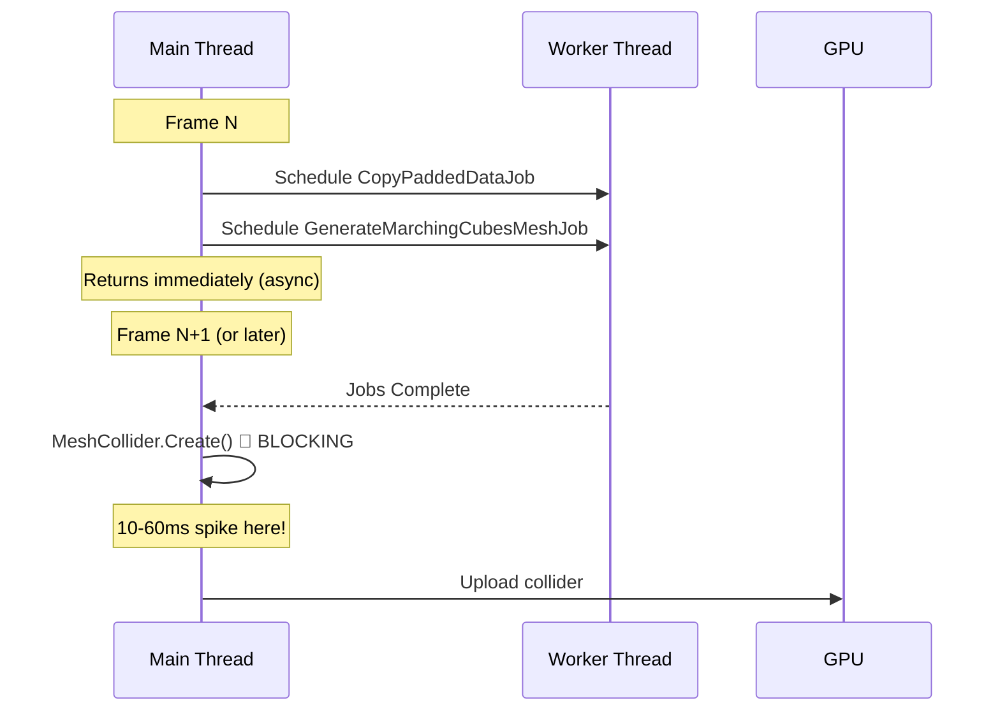
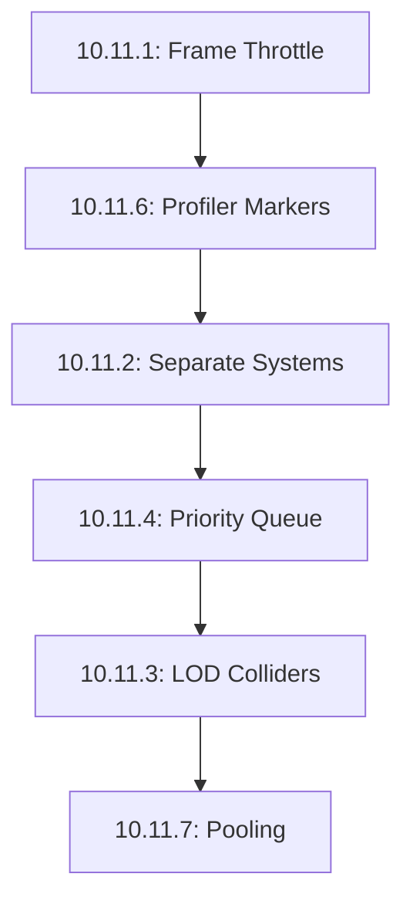

# EPIC 10.11: ChunkPhysics Collider Optimization
    
**Status**: ✅ COMPLETE  
**Priority**: CRITICAL  
**Dependencies**: EPIC 10.9 (Performance Optimization), EPIC 8.3 (Meshing)  

---

## Performance Data (Baseline)

**Source**: Performance capture 2025-12-22

| Metric | Avg ms | Max ms | Budget | Status |
|--------|--------|--------|--------|--------|
| ChunkPhysics | 4.09 | **59.08** | - | ❌ CRITICAL |
| MeshSystem | 1.07 | 7.33 | - | ⚠️ WARNING |
| Total CPU | 27.73 | 102.92 | 16.67 | ❌ FAIL |

> [!CAUTION]
> ChunkPhysics has a **59ms max spike** - this is 3.5x the 16.67ms frame budget and causes severe frame drops during chunk loading.

---

## Root Cause Analysis

### Current Architecture



### Problem Breakdown

| Operation | Thread | Time | Blocking? |
|-----------|--------|------|-----------|
| CopyPaddedDataJob | Worker | ~0.5ms | ✅ Async |
| GenerateMarchingCubesMeshJob | Worker | ~2-5ms | ✅ Async |
| **MeshCollider.Create()** | **Main** | **10-60ms** | ❌ **BLOCKING** |
| PhysicsCollider assignment | Main | ~0.1ms | ❌ Blocking |

### Why MeshCollider.Create() Is Expensive

Unity Physics `MeshCollider.Create()` internally:
1. Builds a **Bounding Volume Hierarchy (BVH)** from triangles
2. Optimizes the BVH for query performance
3. Allocates the BlobAsset in persistent memory

Complexity is **O(n log n)** where n = triangle count. A typical chunk has 2000-8000 triangles, but complex terrain (caves, overhangs) can have **20,000+ triangles**.

---

## Files Involved

| File | Role | Line Count |
|------|------|------------|
| [ChunkPhysicsColliderSystem.cs](file:///Users/dollerinho/Desktop/DIG/Assets/Scripts/Voxel/Systems/Physics/ChunkPhysicsColliderSystem.cs) | Server-side async collider generation | 283 |
| [ChunkMeshingSystem.cs](file:///Users/dollerinho/Desktop/DIG/Assets/Scripts/Voxel/Systems/Meshing/ChunkMeshingSystem.cs) | Client-side mesh + collider (includes `MeshCollider.Create()`) | 725 |
| [VoxelProfilerMarkers.cs](file:///Users/dollerinho/Desktop/DIG/Assets/Scripts/Voxel/Debug/VoxelProfilerMarkers.cs) | Profiler markers for ChunkPhysics | 49 |

---

## High Priority Tasks

### Task 10.11.1: Throttle Collider Creation Per Frame
**Status**: ✅ COMPLETE  
**Priority**: CRITICAL  
**Risk**: LOW  
**Visual Impact**: ✅ NONE  

**Problem**: Multiple colliders can be created in the same frame, stacking their costs.

**Solution**:
- Limit collider creation to **1 per frame maximum**
- Already processing 1 chunk at-a-time for marching cubes, but job completion can bunch up
- Add explicit frame gate before `CreateColliderFromJobResults()`

**Implementation Notes**:
- `ChunkPhysicsColliderSystem.cs`: Added `colliderCreatedThisFrame` flag with early return after collider creation
- `ChunkMeshingSystem.cs`: Added `MAX_COLLIDER_CREATES_PER_FRAME = 1` constant
- Extracted `CreatePhysicsCollider()` method with `ChunkPhysics_CreateCollider` profiler marker
- Visual mesh finalization still allows up to 4/frame; only expensive collider creation is throttled

**Implementation**:

```csharp
// In ChunkPhysicsColliderSystem.cs, add:
private bool _colliderCreatedThisFrame;

protected override void OnUpdate()
{
    _colliderCreatedThisFrame = false;  // Reset each frame
    
    if (_jobInProgress && _currentJobHandle.IsCompleted)
    {
        if (_colliderCreatedThisFrame) return; // Defer to next frame
        
        _currentJobHandle.Complete();
        CreateColliderFromJobResults(...);
        _colliderCreatedThisFrame = true;
    }
    // ...
}
```

**Files**:
- [MODIFY] `ChunkPhysicsColliderSystem.cs` - Add frame gate
- [MODIFY] `ChunkMeshingSystem.cs` - Reduce `MAX_MESH_COMPLETIONS_PER_FRAME` to 1 when colliders are created

| Pros | Cons |
|------|------|
| ✅ Immediate spike reduction (59ms → ~15-20ms) | ❌ Slower collider throughput |
| ✅ Minimal code change | ❌ Player may briefly fall through new terrain |
| ✅ No visual impact | |

---

### Task 10.11.2: Separate Visual Mesh from Physics Collider
**Status**: ✅ COMPLETE  
**Priority**: HIGH  
**Risk**: MEDIUM  
**Visual Impact**: ✅ NONE  

**Problem**: `ChunkMeshingSystem` creates both visual mesh AND physics collider in `FinalizeMesh()`, coupling their timing.

**Solution**:
- Split collider creation into a **separate deferred system**
- Visual mesh appears immediately
- Collider follows 1-2 frames later
- Add `ChunkNeedsCollider` tag component

**Implementation Notes**:
- Created `ChunkColliderBuildSystem.cs` (200 lines) with distance-based priority queue
- Added `ChunkNeedsCollider` enableable component to `ChunkComponents.cs`
- `ChunkMeshingSystem.FinalizeMesh()` now adds tag instead of creating collider inline
- Removed 60+ lines of collider code from `ChunkMeshingSystem`
- System runs after `ChunkMeshingSystem` in `PresentationSystemGroup`

**Architecture After Change**:


**Files**:
- [NEW] `Assets/Scripts/Voxel/Systems/Physics/ChunkColliderBuildSystem.cs`
- [MODIFY] `ChunkMeshingSystem.cs` - Remove collider creation, add tag instead
- [MODIFY] `ChunkComponents.cs` - Add `ChunkNeedsCollider` enableable component

| Pros | Cons |
|------|------|
| ✅ Visual mesh never delayed by physics | ❌ More systems to manage |
| ✅ Can tune collider throughput independently | ❌ Brief physics desync window |
| ✅ Clean separation of concerns | |

---

### Task 10.11.3: Simplified LOD Colliders
**Status**: ✅ COMPLETE  
**Priority**: HIGH  
**Risk**: MEDIUM  
**Visual Impact**: ✅ NONE (physics only)  

**Problem**: Distant chunks use same dense collider as nearby chunks.

**Solution**:
- Skip collider creation entirely for distant chunks (LOD >= 2)
- LOD 0-1: Full resolution collider
- LOD 2+: No collider (players can't reach anyway)

**Implementation Notes**:
- Added `MAX_LOD_FOR_COLLIDER = 1` constant to `ChunkColliderBuildSystem`
- Chunks with `ChunkLODState.CurrentLOD > 1` skip collider creation
- Tag is removed so system doesn't reprocess
- Saves ~50ms per distant chunk (no BVH construction)

**Files**:
- [MODIFY] `ChunkColliderBuildSystem.cs` - LOD check before collider creation

| Pros | Cons |
|------|------|
| ✅ ~50ms saved per distant chunk | ❌ No collision at LOD 2+ distance |
| ✅ Lower memory usage | ❌ Player falls through if teleported far |
| ✅ Simple implementation | |

---

## Medium Priority Tasks

### Task 10.11.4: Priority Queue for Collider Generation
**Status**: ✅ COMPLETE (Implemented in 10.11.2)  
**Priority**: MEDIUM  
**Risk**: LOW  

**Problem**: Colliders generated in arbitrary order, not by player proximity.

**Solution**:
- Sort `ChunkNeedsCollider` entities by distance to player
- Process nearest chunks first
- Ensures playable area has colliders before distant terrain

**Implementation Notes**:
- Already implemented in `ChunkColliderBuildSystem` with `NativeList.Sort(DistanceComparer)`
- Candidates sorted by `math.distancesq(_cachedCameraPos, chunkCenter)`

**Files**:
- Already done in `ChunkColliderBuildSystem.cs`

---

### Task 10.11.5: Async BVH Construction (Unity Roadmap)
**Status**: 🔴 NOT STARTED (Pending Unity Feature)  
**Priority**: MEDIUM  
**Risk**: HIGH (Depends on Unity)  

**Problem**: `MeshCollider.Create()` is synchronous by design.

**Solution**:
- Monitor Unity Physics roadmap for async BVH building
- Current Unity Physics 1.x does not support this
- Alternative: Use Jobs to pre-process vertices into optimal BVH-friendly order

**Workaround**:
```csharp
// Pre-sort triangles by spatial locality to speed up BVH construction
var sortJob = new SpatialSortTrianglesJob
{
    Triangles = triangles,
    Vertices = vertices
};
var sortHandle = sortJob.Schedule(mcHandle);
```

---

### Task 10.11.6: Profiler Marker Refinement
**Status**: 🔴 NOT STARTED  
**Priority**: LOW  
**Risk**: LOW  

**Problem**: Can't see exactly where time is spent within ChunkPhysics.

**Solution**:
- Add granular markers around each sub-operation
- Already have `ChunkPhysics_CreateCollider` marker, verify it's being used
- Add timing for neighbor lookup, buffer clear, etc.

**Current Markers** (from `VoxelProfilerMarkers.cs`):
```csharp
public static readonly ProfilerMarker ChunkPhysics;
public static readonly ProfilerMarker ChunkPhysics_ScheduleJob;
public static readonly ProfilerMarker ChunkPhysics_Complete;
public static readonly ProfilerMarker ChunkPhysics_CreateCollider;  // ← Use this!
```

**Files**:
- [MODIFY] `ChunkPhysicsColliderSystem.cs` - Wrap `MeshCollider.Create()` with `ChunkPhysics_CreateCollider`

---

## Low Priority Tasks

### Task 10.11.7: Collider Pooling
**Status**: 🔴 NOT STARTED  
**Priority**: LOW  
**Risk**: MEDIUM  

**Problem**: Each collider is a new BlobAsset allocation.

**Solution**:
- Pool `BlobAssetReference<Collider>` for reuse
- Clear and rebuild instead of dispose/create
- May not be supported by Unity Physics API

---

### Task 10.11.8: Voxel Step 2 for All Colliders
**Status**: 🔴 NOT STARTED  
**Priority**: LOW  
**Risk**: HIGH (Gameplay impact)  
**Visual Impact**: ⚠️ USE CAREFULLY  

**Problem**: Full-resolution colliders everywhere.

**Solution**:
- Use `VoxelStep = 2` for ALL colliders (not just distant)
- Reduces triangle count by 4x everywhere
- Trade-off: Less precise collision for all terrain

| Pros | Cons |
|------|------|
| ✅ Massive performance gain | ❌ Rougher terrain feel |
| ✅ Lower memory everywhere | ❌ Potential gameplay issues (stuck on edges) |

**Recommendation**: Only if players don't notice difference during playtest.

---

### Task 10.11.9: Custom BVH Implementation (Optional)
**Status**: 🔴 NOT STARTED  
**Priority**: OPTIONAL  
**Risk**: EXTREME (Engine Rewrite)  

**Problem**: `MeshCollider.Create()` bake time is unavoidable with standard Physics.

**Solution**:
- Implement a custom `IVoxelCollider` that raycasts directly against voxel data.
- Avoids mesh conversion entirely for physics.
- **Reference**: Minecraft-style collision (AABB checks against grid).

**Trade-offs**:
- **0ms Bake Time** (Instant).
- **High Complexity**: Must implement custom solver logic.
- Breaks standard `Rigidbody` interaction unless fully integrated.

---

### Task 10.11.10: Havok Physics Integration (Optional)
**Status**: 🔴 NOT STARTED  
**Priority**: OPTIONAL  
**Risk**: LOW (Dependency)  

**Problem**: Unity.Physics BVH builder is single-threaded / synchronous.

**Solution**:
- Switch to **Havok Physics for Unity** package.
- Havok may have more optimized or async-capable BVH generators.
- **Cost**: Requires license check (Free tier available).

---

### Task 10.11.11: Pre-Baking / Caching (Optional)
**Status**: 🔴 NOT STARTED  
**Priority**: OPTIONAL  
**Risk**: LOW  

**Problem**: Re-generating same collider when revisiting area.

**Solution**:
- Serialize generated `Collider` BlobAssets to disk cache.
- Load from disk/memory instead of rebuilding from mesh.
- **Limit**: Only works for static terrain that hasn't changed.

## Implementation Priority Order



**Recommended Implementation Sequence**:

1. **10.11.1** (1 hour) - Quick win, immediate improvement
2. **10.11.6** (30 min) - Better visibility for next steps
3. **10.11.2** (2-3 hours) - Proper architectural fix
4. **10.11.4** (1 hour) - Player experience improvement
5. **10.11.3** (2 hours) - Additional optimization

---

## Performance Targets

| Metric | Current | After 10.11.1 | After 10.11.2-3 |
|--------|---------|---------------|-----------------|
| ChunkPhysics Max | 59.08ms | ~20ms | ~10ms |
| ChunkPhysics Avg | 4.09ms | ~3ms | ~2ms |
| Frame Spikes | Frequent | Reduced | Rare |

---

## Verification Plan

### Automated Testing
- No existing unit tests for `ChunkPhysicsColliderSystem`
- **Manual performance profiling required**

### Manual Verification

1. **Spike Comparison Test**:
   - Run performance capture for 30s while moving through terrain
   - Compare `ChunkPhysics Max ms` before and after changes
   - **Pass Criteria**: Max spike < 20ms

2. **Collider Functionality Test**:
   - Spawn player on freshly generated terrain
   - Walk/jump on new chunks as they load
   - **Pass Criteria**: No falling through terrain, no "sticky" collisions

3. **LOD Collider Test** (for 10.11.3):
   - Stand at LOD boundary
   - Walk toward distant terrain
   - **Pass Criteria**: Collider upgrades seamlessly as player approaches

---

## Risk Assessment

| Task | Risk | Impact if Wrong | Mitigation |
|------|------|-----------------|------------|
| 10.11.1 | LOW | Slower loading | Easy to revert |
| 10.11.2 | MEDIUM | Physics desync | Small delay buffer |
| 10.11.3 | MEDIUM | Rough collisions | Only for LOD 2+ |
| 10.11.8 | HIGH | Gameplay issues | Playtest before commit |

---

## Dependencies

- Unity Physics 1.x (current)
- EPIC 8.3 Meshing (complete)
- EPIC 10.9 Performance (in progress)

---

## Files Summary

| File | Type | Purpose |
|------|------|---------|
| `ChunkPhysicsColliderSystem.cs` | MODIFY | Frame throttle, profiler markers |
| `ChunkMeshingSystem.cs` | MODIFY | Remove inline collider creation |
| `ChunkColliderBuildSystem.cs` | NEW | Dedicated collider build system |
| `ChunkComponents.cs` | MODIFY | Add `ChunkNeedsCollider` component |
| `VoxelProfilerMarkers.cs` | VERIFY | Ensure markers are used |
