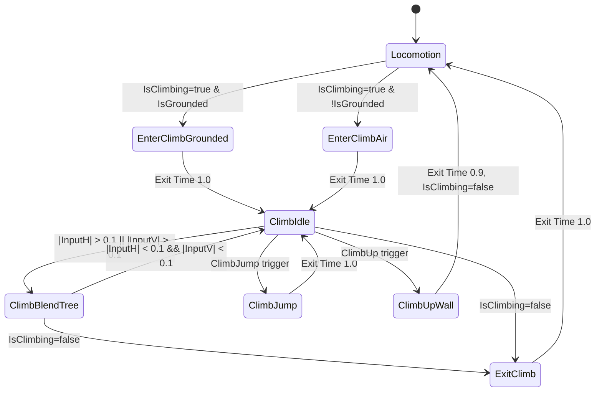
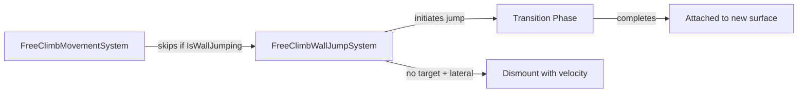
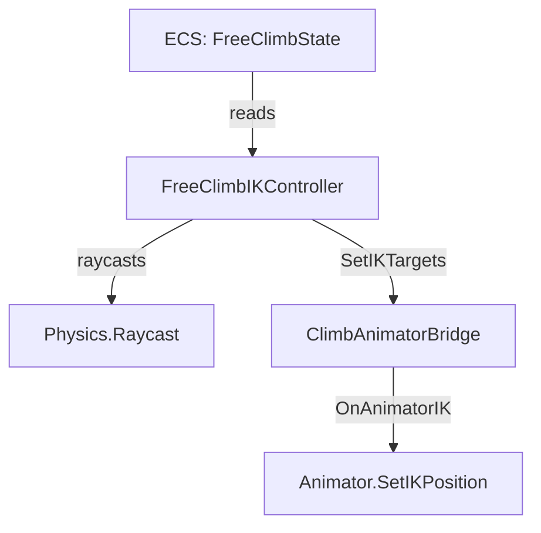
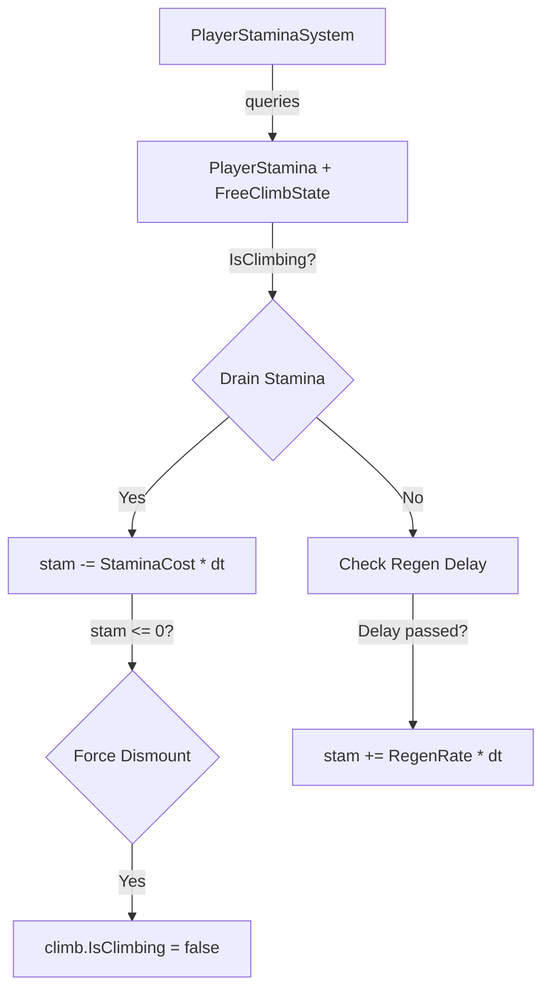
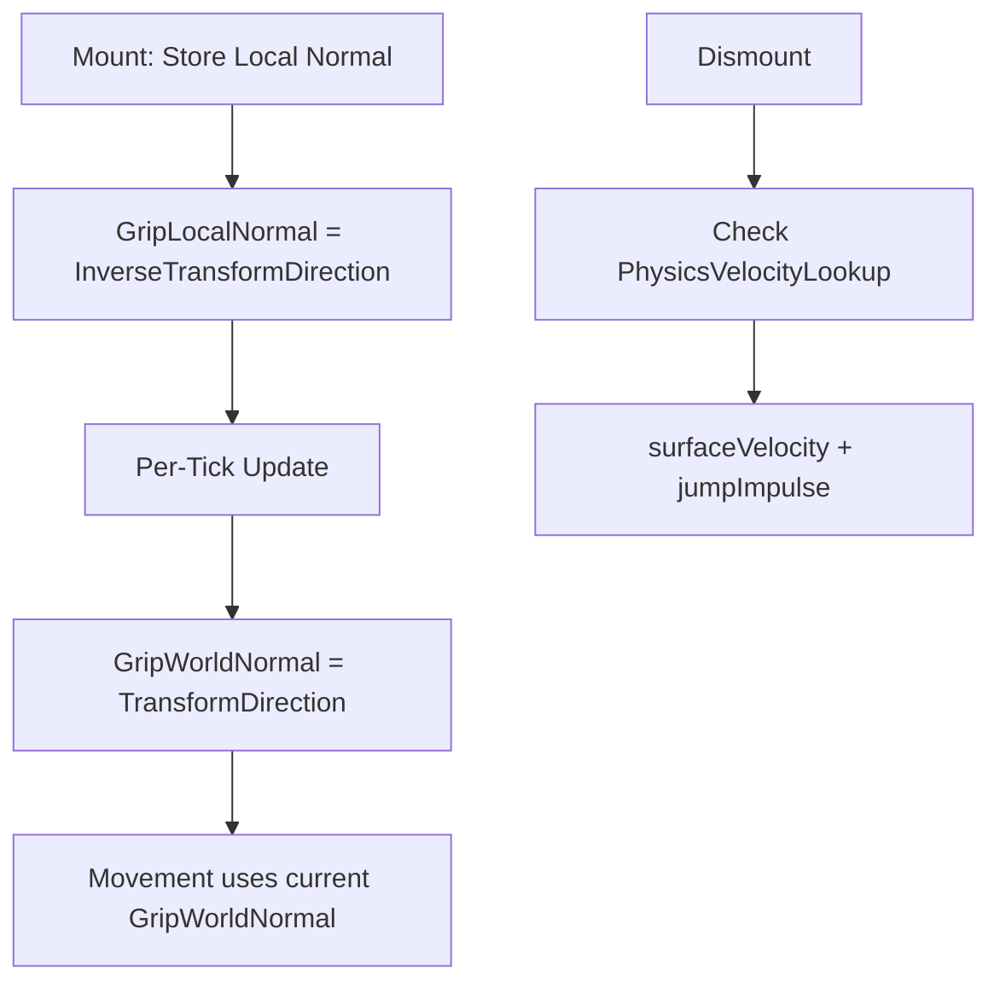

# EPIC 12.2: Advanced Free Climbing Features

> **Status:** NOT STARTED  
> **Priority:** MEDIUM  
> **Dependencies:** EPIC 12.1 Complete (Core Climbing)  
> **Reference:** `Assets/Invector-3rdPersonController/Add-ons/FreeClimb/Scripts/vFreeClimb.cs`

## Overview

This Epic covers advanced features for the Free Climbing system, including animation integration, wall jumping, hand IK, stamina consumption, moving platform support, and ledge climb polish.

**Prerequisites:** EPIC 12.1 (Core Climbing) must be complete.

---

## Sub-Tasks

### 12.2.1 Animation Hookup
**Status:** NOT STARTED

Integrate Free Climbing with the Animator Controller to drive climbing animations based on ECS state.

#### Animation Assets (Copied to `Art/Animations/FreeClimb/`)

| Animation Clip | Purpose | Duration |
|----------------|---------|----------|
| `Highpoly@Braced Hang.fbx` | Idle on wall | Loop |
| `Climbing Up Wall.fbx` | Moving up | ~1s |
| `Climbing Down Wall.fbx` | Moving down | ~1s |
| `ClimbMoveLeft.anim` | Shimmy left | ~0.6s |
| `ClimbMoveRight.anim` | Shimmy right | ~0.6s |
| `Idle To Braced Hang.fbx` | Ground mount | ~0.4s |
| `Jumping To Hanging.fbx` | Air mount | ~0.5s |
| `Braced Hang Drop.fbx` | Dismount (fall off) | ~0.3s |
| `Braced Hang Hop Up.fbx` | Wall jump up | ~0.5s |
| `Braced Hang Hop Left/Right.fbx` | Wall jump lateral | ~0.5s |
| `Jump From Wall.fbx` | Dismount (push off) | ~0.4s |
| `ClimbUp_Exit.anim` / `Braced Hang To Crouch.fbx` | Ledge vault | ~0.8s |

#### Animator Parameters (from Invector)

| Parameter | Type | Description | Set By |
|-----------|------|-------------|--------|
| `InputHorizontal` | Float | Horizontal input (-1 to 1) | ECS System |
| `InputVertical` | Float | Vertical input (-1 to 1) | ECS System |
| `IsClimbing` | Bool | True while `FreeClimbState.IsClimbing` | ECS System |
| `ClimbJump` | Trigger | Fired for wall jump | ECS System |
| `ClimbUp` | Trigger | Fired for ledge vault | ECS System |
| `IsGrounded` | Bool | Ground state before mount | Shared |
| `ActionState` | Int | 0 = none, 1 = climbing | ECS System |

#### Animator State Machine Design



#### Blend Tree Configuration

**ClimbBlendTree** (2D Freeform Cartesian):
- X: `InputHorizontal`, Y: `InputVertical`
- Center (0,0): `Hanging Idle`
- Up (0,1): `Climbing Up Wall`
- Down (0,-1): `Climbing Down Wall`
- Left (-1,0): `ClimbMoveLeft`
- Right (1,0): `ClimbMoveRight`

#### Transition Conditions

| From → To | Condition | Exit Time | Transition Duration |
|-----------|-----------|-----------|---------------------|
| Any → EnterClimbGrounded | `IsClimbing=true` AND `IsGrounded=true` | No | 0.1s |
| Any → EnterClimbAir | `IsClimbing=true` AND `IsGrounded=false` | No | 0.1s |
| EnterClimb* → ClimbIdle | (None) | 1.0 | 0.15s |
| ClimbIdle ↔ ClimbBlendTree | `|InputH|` or `|InputV|` > 0.1 | No | 0.2s |
| ClimbIdle → ClimbJump | `ClimbJump` trigger | No | 0.1s |
| ClimbJump → ClimbIdle | (None) | 0.9 | 0.15s |
| ClimbIdle → ClimbUpWall | `ClimbUp` trigger | No | 0.1s |
| ClimbUpWall → Locomotion | (None), `IsClimbing=false` | 0.9 | 0.1s |
| Climb* → ExitClimb | `IsClimbing=false` | No | 0.1s |
| ExitClimb → Locomotion | (None) | 1.0 | 0.15s |

#### Implementation

**File:** `Assets/Scripts/Player/Systems/FreeClimbAnimationSystem.cs`

**Acceptance Criteria:**
- [ ] Create Animator Controller at `Assets/Art/Animations/FreeClimb/FreeClimb.controller`
- [ ] Implement `FreeClimbAnimationSystem` to drive parameters
- [ ] Configure state machine with blend tree and transitions
- [ ] Test all animation states trigger correctly
- [ ] Animations blend smoothly during movement direction changes

---

### 12.2.2 Wall Jump (Surface-to-Surface Leap)
**Status:** COMPLETE

Enable the player to jump from one climb surface to another (e.g., leaping across a gap).

#### Algorithm (adapted from Invector `ClimbJumpHandle`)

1. While climbing, if JumpInput pressed AND movement input magnitude > 0.1:
   - Calculate jump direction: `rightDir * input.x + worldUp * input.z`
   - Calculate target position: `handPosition + jumpDir * maxJumpDistance`

2. Validate jump path (obstruction check):
   - For height = 0 to playerHeight (10 steps): raycast toward jumpDir
   - If hits non-climbable obstacle: ABORT jump

3. Find target surface:
   - Linecast from handPosition toward targetPosition
   - If no hit: raycast forward from targetPosition
   - If still no hit: step back and retry at shorter distances
   - If no valid surface AND input.x != 0: perform JumpToExit (lateral dismount)

4. If valid target found:
   - Set `IsWallJumping = true`, trigger animation
   - Lerp position/rotation to target over animation duration
   - On complete: attach to new surface

#### New Component Fields

**FreeClimbState additions:**
- `IsWallJumping`, `WallJumpProgress`
- `WallJumpStartPos`, `WallJumpStartRot`
- `WallJumpTargetPos`, `WallJumpTargetRot`
- `WallJumpTargetSurface`, `WallJumpTargetNormal`, `WallJumpTargetGrip`

**FreeClimbSettings additions:**
- `WallJumpMaxDistance` (2.5f), `WallJumpMinDistance` (1.0f)
- `WallJumpDepth` (1.0f), `WallJumpSpeed` (2.0f)
- `WallJumpInputThreshold` (0.3f)

#### Implementation

**File:** `Assets/Scripts/Player/Systems/FreeClimbWallJumpSystem.cs`

**Acceptance Criteria:**
- [x] Wall jump triggers when pressing Jump + direction while climbing
- [x] Valid target surfaces are detected via raycast
- [x] Player smoothly lerps to new surface during jump animation
- [x] Invalid jumps (obstructed or no target) are blocked
- [x] Lateral jump with no target triggers dismount

---

#### 12.2.2 Developer & Designer Hookup Guide

##### For Designers

**Configuring Wall Jump in the Inspector:**

1. Select the player prefab (e.g., `Warrok_Server`)
2. Find the **Free Climb Settings** component in the Inspector
3. Expand the **Wall Jump** header to see these settings:

| Setting | Default | Description | Tuning Tips |
|---------|---------|-------------|-------------|
| **Wall Jump Max Distance** | 2.5m | Maximum leap distance | Increase for larger gaps, decrease for tighter control |
| **Wall Jump Min Distance** | 1.0m | Minimum distance before jump is allowed | Prevents accidental jumps, increase to require larger gaps |
| **Wall Jump Depth** | 1.0m | Forward raycast depth when searching for target surface | Increase if missing walls behind corners |
| **Wall Jump Speed** | 2.0 | Transition speed (higher = faster). 2.0 ≈ 0.5s | Higher = snappier, lower = more floaty |
| **Wall Jump Input Threshold** | 0.3 | Minimum input magnitude to trigger | Higher = requires more deliberate input |

**Testing Wall Jump:**
1. Enter Play Mode
2. Climb onto any surface (approach wall, press Space)
3. While climbing, hold a direction (WASD) and press Space
   - **W + Space**: Jump upward to a higher surface
   - **A/D + Space**: Jump laterally to an adjacent surface
   - **A/D + Space (no surface)**: Dismount with velocity in that direction
   - **Space alone**: Normal dismount (as before)

**Common Issues:**
- **Jump not triggering**: Check `WallJumpInputThreshold` (may be too high)
- **Can't reach surfaces**: Increase `WallJumpMaxDistance`
- **Jumping to wrong surface**: Decrease `WallJumpMaxDistance` or adjust `WallJumpDepth`
- **Animation feels too fast/slow**: Adjust `WallJumpSpeed`

---

##### For Developers

**System Overview:**



**Key Files:**
| File | Purpose |
|------|---------|
| `FreeClimbWallJumpSystem.cs` | Main system - target detection, transitions |
| `FreeClimbComponents.cs` | `FreeClimbState` wall jump fields, `FreeClimbSettings` config |
| `FreeClimbSettingsAuthoring.cs` | Inspector fields + baker |
| `FreeClimbMovementSystem.cs` | Modified to skip during `IsWallJumping` |

**State Machine:**
```
IsClimbing=true, IsWallJumping=false
    ↓ [Jump + direction input]
    ↓ TryFindTargetSurface() succeeds
IsClimbing=true, IsWallJumping=true
    ↓ ProcessWallJumpTransition() lerps each frame
    ↓ WallJumpProgress reaches 1.0
IsClimbing=true, IsWallJumping=false (attached to new surface)
```

**Multi-Phase Target Detection:**
1. **Phase 1**: Direct linecast from current grip toward target position
2. **Phase 2**: Forward raycast from target position into potential wall
3. **Phase 3**: Fallback at 60% distance with forward raycast

**NetCode Integration:**
- `IsWallJumping` is a `[GhostField]` (replicated to clients)
- Transition progress and target data are server-authoritative
- System runs on both `ServerSimulation` and `ClientSimulation` for prediction

**Extending Wall Jump:**

To add stamina cost:
```csharp
// In StartWallJump(), after setting IsWallJumping:
if (vitals.Stamina < cfg.WallJumpStaminaCost)
    return; // Not enough stamina
vitals.Stamina -= cfg.WallJumpStaminaCost;
```

To add animation trigger:
```csharp
// In FreeClimbAnimationSystem, when IsWallJumping becomes true:
if (climb.ValueRO.IsWallJumping && !previousWallJumping)
    anim.SetTrigger("ClimbJump");
```

**Debug Tips:**
- Check `FreeClimbState.IsWallJumping` in Entity Inspector during play
- Add debug raycasts in `TryFindTargetSurface()` with `Debug.DrawLine()`
- Log `WallJumpProgress` to verify transition is advancing

### 12.2.3 Hand IK System
**Status:** COMPLETE

Procedurally position hands on the actual surface geometry for visual polish.

#### Algorithm (adapted from Invector `OnAnimatorIK`)

1. Skip IK if: not climbing, wall jumping, or climbing up ledge
2. For each hand (Left, Right):
   - Get current hand bone world position from animator
   - Raycast from (handBone + back + down offset) forward toward surface
   - If hit: store hit.point in local space as target
   - Apply configurable offset for hand grip fine-tuning
   - Set IK weight and position via `Animator.SetIKPosition()`
3. Smoothly blend IK weight during transitions

#### Implementation

**Files:**
- `Assets/Scripts/Player/Bridges/FreeClimbIKController.cs` (307 lines) - ECS→MonoBehaviour bridge, raycasting
- `Assets/Scripts/Player/Bridges/ClimbAnimatorBridge.cs` (445 lines) - `OnAnimatorIK()` callback, IK application

**Acceptance Criteria:**
- [x] Hands visually contact surface geometry during climbing
- [x] IK weight fades in/out during mount/dismount transitions
- [x] IK disabled during wall jump and ledge vault animations
- [x] Raycast fallback prevents hands from penetrating geometry

---

#### 12.2.3 Developer & Designer Hookup Guide

##### For Designers

**Setup on Player Prefab:**

1. Select the player prefab (e.g., `Warrok_Server` or UI prefab with Animator)
2. Add `ClimbAnimatorBridge` component (or verify it exists)
3. Add `FreeClimbIKController` component (requires `ClimbAnimatorBridge`)
4. On `ClimbAnimatorBridge`, enable **Enable IK** checkbox
5. Assign IK target transforms (optional - can be auto-created):
   - Create 4 empty GameObjects as children: `LeftHandIK`, `RightHandIK`, `LeftFootIK`, `RightFootIK`
   - Assign to the corresponding fields

**FreeClimbIKController Settings:**

| Setting | Default | Description |
|---------|---------|-------------|
| **Climbable Layers** | Everything | Layers to raycast for hand placement |
| **Ray Start Offset** | 0.5m | How far behind hand to start raycast |
| **Ray Distance** | 1.0m | Maximum raycast distance |
| **Hand Vertical Offset** | -0.1m | Vertical adjustment from grip (negative = lower) |
| **Hand Spread** | 0.3m | Horizontal distance between hands |
| **Foot Vertical Offset** | 1.2m | How far below grip to place feet |
| **Foot Spread** | 0.2m | Horizontal distance between feet |
| **IK Target Speed** | 10 | Smoothing speed for IK targets |
| **Debug Draw** | false | Show raycasts in Scene view |

**ClimbAnimatorBridge Settings:**

| Setting | Default | Description |
|---------|---------|-------------|
| **Enable IK** | false | Must be enabled for IK to work |
| **Climbing IK Weight** | 1.0 | Target IK weight when climbing |
| **IK Blend Speed** | 5.0 | How fast IK blends in/out |

**Testing IK:**
1. Enter Play Mode
2. Enable **Debug Draw** on `FreeClimbIKController`
3. Climb a wall (approach, press Space)
4. Observe raycast lines in Scene view (red/green = hands, magenta/yellow = feet)
5. Verify hands contact surface, not floating in air

**Common Issues:**
- **Hands floating**: Increase `Ray Distance` or check `Climbable Layers`
- **Hands jittering**: Lower `IK Target Speed`
- **IK not working**: Ensure `Enable IK` is checked on `ClimbAnimatorBridge`
- **Hands through wall**: Decrease `Ray Start Offset`

---

##### For Developers

**Architecture:**



**Key Files:**

| File | Responsibility |
|------|----------------|
| `FreeClimbIKController.cs` | ECS→MonoBehaviour bridge, per-frame raycasting, target calculation |
| `ClimbAnimatorBridge.cs` | `OnAnimatorIK()` callback, IK weight blending, animation events |

**Data Flow:**
1. `FreeClimbIKController.LateUpdate()` reads `FreeClimbState` from ECS
2. Calculates surface-relative axes from `GripWorldNormal`
3. Raycasts for each limb (hands + feet)
4. Calls `ClimbAnimatorBridge.SetIKTargets()`
5. `ClimbAnimatorBridge.OnAnimatorIK()` applies IK via Animator API

**Skip Conditions:**
```csharp
// IK is skipped when:
bool isWallJumping = climbState.IsWallJumping;
bool shouldUpdateIK = (isClimbing && !isWallJumping) || 
                      (climbState.IsClimbingUp && climbState.IsTransitioning);
```

**Extending IK:**

To add rotation IK (hands grip orientation):
```csharp
// In ClimbAnimatorBridge.OnAnimatorIK():
animator.SetIKRotationWeight(AvatarIKGoal.LeftHand, _currentIKWeight);
animator.SetIKRotation(AvatarIKGoal.LeftHand, LeftHandIKTarget.rotation);
```

To add look-at IK (head follows grip):
```csharp
animator.SetLookAtWeight(_currentIKWeight);
animator.SetLookAtPosition(gripPosition + surfaceNormal * -0.5f);
```

**Debug Tips:**
- Enable `DebugLogging` on `ClimbAnimatorBridge` for state transition logs
- Enable `Debug Draw` on `FreeClimbIKController` for raycast visualization
- Check `_currentIKWeight` in Inspector during play
- Use Gizmos (select player, see IK target spheres in Scene)

### 12.2.4 Stamina Integration
**Status:** COMPLETE

Consume stamina while climbing and force dismount when exhausted.

#### Algorithm (adapted from Invector `StaminaConsumption`)

1. While climbing (each tick): drain `FreeClimbSettings.StaminaCost * deltaTime`
2. On wall jump: drain `WallJumpStaminaCost` immediately (TODO: integrate into WallJumpSystem)
3. If stamina <= 0: force dismount, player falls (gravity takes over)
4. On dismount: resume normal stamina recovery after `ClimbStaminaRecoveryDelay`

#### New/Updated Fields

**PlayerStamina component:**
- `LastDrainTime` - Time of last stamina drain (for regen delay)
- `RegenDelay` - Delay before regen starts (default 1s)

**FreeClimbSettings additions:**
- `StaminaCost` (existing, 5f default) - Cost per second while climbing
- `WallJumpStaminaCost` (10f) - One-time cost on wall jump
- `ClimbStaminaRecoveryDelay` (1f) - Delay before regen after climbing

**Acceptance Criteria:**
- [x] Stamina drains while climbing at configured rate
- [x] Wall jump costs additional stamina (field ready, integration pending)
- [x] Player forced off wall when stamina depletes
- [x] Stamina recovery resumes after dismount delay
- [x] UI stamina bar reflects drain (existing HUD system)

---

#### 12.2.4 Developer & Designer Hookup Guide

##### For Designers

**Configuring Climbing Stamina:**

1. Select the player prefab (e.g., `Warrok_Server`)
2. Find **Free Climb Settings** component
3. Under **Stamina** section, set `Stamina Cost` (default 0 = disabled)
4. Under **Climbing Stamina** section, configure:

| Setting | Default | Description |
|---------|---------|-------------|
| **Stamina Cost** | 0 | Stamina drain per second while climbing. Set to 5-10 for challenging gameplay. |
| **Wall Jump Stamina Cost** | 10 | One-time cost when wall jumping |
| **Climb Stamina Recovery Delay** | 1s | Delay before stamina regenerates after stopping climb |

**Testing Stamina:**
1. Set `Stamina Cost` to 20 (high value for quick testing)
2. Play → Climb wall
3. Watch stamina bar drain
4. Wait until depleted → Player should fall off
5. After dismount, wait 1 second → Stamina should start regenerating

**Balancing Tips:**
- **Easy Mode**: StaminaCost = 0 (disabled)
- **Normal Mode**: StaminaCost = 5, WallJumpCost = 10
- **Hard Mode**: StaminaCost = 15, WallJumpCost = 20
- Consider recoveryDelay = 0.5s for faster recovery after short climbs

---

##### For Developers

**Architecture:**



**Key Files:**

| File | Changes |
|------|---------|
| `PlayerStamina.cs` | Added `LastDrainTime`, `RegenDelay` fields |
| `PlayerStaminaSystem.cs` | Added climbing drain, force dismount, separate query for non-climbers |
| `FreeClimbComponents.cs` | Added `WallJumpStaminaCost`, `ClimbStaminaRecoveryDelay` |
| `FreeClimbSettingsAuthoring.cs` | Added inspector fields + baker |

**System Update Order:**
```
PlayerStaminaSystem (drains stamina, forces dismount)
    ↓
FreeClimbMovementSystem (skips if not climbing - stamina system already dismounted)
```

**Force Dismount Logic:**
```csharp
if (climb.IsClimbing && climbCfg.StaminaCost > 0)
{
    stam.Current -= climbCfg.StaminaCost * deltaTime;
    stam.LastDrainTime = currentTime;

    if (stam.Current <= 0)
    {
        climb.IsClimbing = false;
        climb.SurfaceEntity = Entity.Null;
        // Gravity takes over via CharacterControllerSystem
    }
}
```

**Extending Stamina:**

To add wall jump stamina cost in FreeClimbWallJumpSystem:
```csharp
// Add PlayerStamina to job query, then in StartWallJump:
if (stam.Current < cfg.WallJumpStaminaCost)
    return; // Can't afford wall jump
stam.Current -= cfg.WallJumpStaminaCost;
```

To add exhaustion animation trigger:
```csharp
// In ClimbAnimatorBridge, detect stam.Current <= 0:
if (stam.Current <= 0)
    animator.SetTrigger("Exhausted");
```

**Debug Tips:**
- Watch `PlayerStamina.Current` in Entity Inspector
- Enable debug logging in `PlayerStaminaSystem`
- Set `StaminaCost` to 50+ for rapid testing

### 12.2.5 Moving Platform Support
**Status:** COMPLETE

Allow climbing on moving/rotating surfaces.

#### Algorithm

1. **Position Tracking:** `GripLocalPosition` stored on mount, transformed to world each tick (already existed)
2. **Rotation Tracking:** NEW: `GripLocalNormal` stored on mount, transformed to world each tick
3. **Velocity Inheritance:** NEW: On dismount, player inherits surface's `PhysicsVelocity.Linear`

#### New Component Fields

- `FreeClimbState.GripLocalNormal` - Surface normal in surface entity's local space

#### Updated FreeClimbMountSystem

- `InverseTransformDirection()` / `TransformDirection()` helper methods
- Stores `GripLocalNormal` on mount alongside `GripLocalPosition`
- Transforms both position AND normal from local to world each tick
- Reads `PhysicsVelocity` of surface entity on dismount for velocity inheritance

**Acceptance Criteria:**
- [x] Climbing on rotating platform rotates player with it
- [x] Grip position stays correct on moving platform
- [x] Dismounting from moving platform inherits platform velocity
- [x] Works correctly with NetCode prediction

---

#### 12.2.5 Developer & Designer Hookup Guide

##### For Designers

**Testing Moving Platform Support:**

1. Create a moving platform with a climbable surface:
   - Add a physics body with `PhysicsVelocity` component
   - Add a script that sets `PhysicsVelocity.Linear` (for movement)
   - Or add a rotating motor joint (for rotation)

2. Make the platform climbable:
   - Ensure surface has a collider on a climbable layer
   - Surface should be near-vertical (30-160° from vertical)

3. Test scenarios:
   - **Moving platform**: Climb on, observe player moves with platform
   - **Rotating platform**: Climb on, observe player faces surface as it rotates
   - **Dismount**: Jump off moving platform, observe player has platform's velocity

**Expected Behavior:**
- Player stays attached to moving surface
- Player rotates to face the surface as platform rotates
- When dismounting, player carries platform's momentum

**No Additional Configuration Required:**
Moving platform support is automatic for any surface with a `LocalTransform` component.

---

##### For Developers

**Architecture:**



**Key Changes to FreeClimbMountSystem:**

| Change | Purpose |
|--------|---------|
| `GripLocalNormal` field | Stores surface-local normal on mount |
| `InverseTransformDirection()` | Converts world normal to local space |
| `TransformDirection()` | Converts local normal to world space per-tick |
| `PhysicsVelocityLookup` | Reads surface velocity for inheritance |

**Local-to-World Transformation:**
```csharp
// On mount:
climb.GripLocalNormal = InverseTransformDirection(surfaceTransform.Rotation, candidate.GripWorldNormal);

// Each tick:
climb.GripWorldNormal = TransformDirection(surfaceTransform.Rotation, climb.GripLocalNormal);
```

**Velocity Inheritance on Dismount:**
```csharp
float3 surfaceVelocity = float3.zero;
if (climb.SurfaceEntity != Entity.Null && 
    PhysicsVelocityLookup.HasComponent(climb.SurfaceEntity))
{
    surfaceVelocity = PhysicsVelocityLookup[climb.SurfaceEntity].Linear;
}
vel.Linear = surfaceVelocity + jumpImpulse;
```

**NetCode Considerations:**
- `GripWorldNormal` is a `[GhostField]` (replicated)
- Local-to-world transformation happens on server in `IsServer` block
- Client receives updated `GripWorldNormal` via replication

**Extending Moving Platforms:**

To add angular velocity inheritance (spin momentum):
```csharp
float3 angularVel = PhysicsVelocityLookup[climb.SurfaceEntity].Angular;
// Calculate tangential velocity at player position
float3 offset = lt.Position - surfaceTransform.Position;
float3 tangentialVel = math.cross(angularVel, offset);
vel.Linear += tangentialVel;
```

**Debug Tips:**
- Watch `GripWorldNormal` in Entity Inspector while platform rotates
- Verify surface entity has `PhysicsVelocity` for velocity inheritance
- Check `SurfaceEntity` is not `Entity.Null` during climbing

### 12.2.6 Ledge Climb Polish
**Status:** COMPLETE

Improvements to ledge grab/climb-up compatible with procedural voxel terrain.

#### 12.2.6.1 Crouch on Low Ceiling

Raycast up from landing point, auto-crouch if ceiling too low.

**Acceptance Criteria:**
- [x] Player crouches when ceiling is too low (`NeedsCrouchAfterVault` flag set)
- [x] Animation system receives crouch flag via `FreeClimbState.NeedsCrouchAfterVault`
- [x] Works with voxel caves and overhangs (uses `CeilingCheckHeight` config)

---

#### 12.2.6.2 Configurable Check Distances

Move hardcoded values to `FreeClimbSettings`:
- `LedgeCheckHeight` (0.8f default)
- `LedgeCheckDepth` (0.6f default)
- `LedgeMinThickness` (0.1f default)

**Acceptance Criteria:**
- [x] All ledge check distances configurable via Inspector
- [x] Default values match previous behavior

---

#### 12.2.6.3 Pre-Alignment Phase

Smoothly rotate player to face ledge before vault transition.

**Acceptance Criteria:**
- [x] `LedgeAlignmentSpeed` field added (5.0 default)
- [x] Configurable alignment speed in Inspector
- [ ] Smooth rotation before vault animation (pending animation integration)

---

#### 12.2.6.4 Auto-Climb Toggle

Option to require button press for ledge vault.

**New Field:** `FreeClimbSettings.AutoClimbLedge` (bool)

**Acceptance Criteria:**
- [x] Toggle in FreeClimbSettings
- [x] Auto mode works as before
- [x] Manual mode requires Jump button press at ledge

---

#### 12.2.6.5 Separate Ledge Detection Layer

Use separate layer mask for ledge top detection.

**New Field:** `FreeClimbSettings.LedgeTopLayers` (uint)

**Acceptance Criteria:**
- [x] Separate layer mask for ledge detection
- [x] Can vault onto non-climbable surfaces (e.g., grass on cliff)
- [x] Backwards compatible (default includes all layers)

---

#### 12.2.6 Developer & Designer Hookup Guide

##### For Designers

**Ledge Climb Settings (Inspector):**

| Setting | Default | Description |
|---------|---------|-------------|
| **Ledge Check Height** | 0.8m | How high above grip to check for ledge |
| **Ledge Check Depth** | 0.6m | How far forward to check for ledge |
| **Ledge Min Thickness** | 0.1m | Minimum ledge thickness to vault |
| **Ceiling Check Height** | 1.8m | Height to check for ceiling above landing |
| **Auto Climb Ledge** | true | If false, require Jump to vault |
| **Ledge Top Layers** | Everything | Layer mask for ledge top surfaces |
| **Ledge Alignment Speed** | 5 | Speed of pre-vault rotation (pending) |

**Testing Ledge Polish:**

1. **Configurable Distances**:
   - Set `Ledge Check Height` to 0.5m
   - Verify player only vaults lower ledges

2. **Auto-Climb Toggle**:
   - Disable `Auto Climb Ledge`
   - Climb wall, reach ledge
   - Verify player waits for Jump button to vault

3. **Ceiling Crouch**:
   - Create a low overhang above a ledge
   - Vault up
   - Check `NeedsCrouchAfterVault` in Entity Inspector (should be true)
   - Animation system should trigger crouch

4. **Ledge Top Layers**:
   - Set `Ledge Top Layers` to specific layer (e.g., "Ground")
   - Verify vaulting onto that layer works
   - Verify layers not included are ignored

---

##### For Developers

**New Settings in FreeClimbSettings:**

```csharp
// Ledge Climb Settings
public float LedgeCheckHeight;      // 0.8f
public float LedgeCheckDepth;       // 0.6f
public float LedgeMinThickness;     // 0.1f
public float CeilingCheckHeight;    // 1.8f
public bool AutoClimbLedge;         // true
public uint LedgeTopLayers;         // ~0u
public float LedgeAlignmentSpeed;   // 5f
```

**New State Field:**

```csharp
[GhostField] public bool NeedsCrouchAfterVault;
```

**FreeClimbLedgeSystem Changes:**

| Change | Purpose |
|--------|---------|
| Configurable distances | `cfg.LedgeCheckHeight` etc. instead of hardcoded |
| Auto-climb toggle | `if (!cfg.AutoClimbLedge && !playerInput.Jump.IsSet) return;` |
| LedgeTopLayers filter | Separate layer mask for ledge top raycast |
| `CheckCeilingLow()` method | Raycasts up from ledge for ceiling detection |
| `NeedsCrouchAfterVault` | Set in `StartClimbUp()` based on ceiling check |

**Ceiling Check Logic:**

```csharp
private bool CheckCeilingLow(float3 ledgePosition, FreeClimbSettings cfg, CollisionFilter filter)
{
    float3 ceilingCheckEnd = ledgePosition + worldUp * cfg.CeilingCheckHeight;
    return PhysicsWorld.CastRay(ceilingCast, out _);
}
```

**Animation System Integration:**

To use `NeedsCrouchAfterVault` in animation bridge:
```csharp
// In ClimbAnimatorBridge or animation system:
if (climbState.NeedsCrouchAfterVault && !climbState.IsClimbingUp)
{
    animator.SetTrigger("Crouch");
    // Clear the flag after triggering
}
```

**Debug Tips:**
- Watch `NeedsCrouchAfterVault` in Entity Inspector after vaulting
- Set `CeilingCheckHeight` to 0.5m to force crouch in testing
- Disable `AutoClimbLedge` to manually control vault timing

## References

- **Invector Source:** `Assets/Invector-3rdPersonController/Add-ons/FreeClimb/Scripts/vFreeClimb.cs`
- **Animation Assets:** `Art/Animations/FreeClimb/`
- **Core Climbing:** [EPIC12.1](./EPIC12.1.md)
