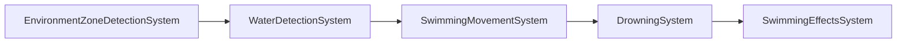

# EPIC 12.3: Physics-Based Swimming System

> **Status:** IN PROGRESS
> **Priority:** MEDIUM
> **Dependencies:** Character Controller (EPIC 1), Environment Zones (EPIC 3)
> **Reference:** `Assets/Invector-3rdPersonController/Add-ons/Swimming/Scripts/vSwimming.cs`

## Overview

Implement a trigger-based swimming system that allows players to swim in water volumes with full 3D movement, proper buoyancy, stamina consumption, and visual effects. This Epic adapts Invector's `vSwimming` module to our Unity ECS/DOTS architecture.

### Problem Statement

Currently, DIG has no swimming implementation. Players entering water volumes either:
1. Walk on the bottom (if water is shallow)
2. Fall through (if water has no collision)
3. Get stuck (if water has blocking collision)

### Solution Architecture

Adopt Invector's trigger-based approach:
- **Water Detection via Triggers** - Water volumes are trigger colliders with "Water" tag
- **Depth Tracking** - Compare player center height to water surface level
- **Rigidbody Adjustments** - Disable gravity, increase drag during swim
- **Collider Adjustments** - Reduce capsule size when underwater
- **Stamina Drain** - Deplete stamina while submerged, damage when empty

---

## Architecture

### Core Components

| Component | Description | File |
|-----------|-------------|------|
| `SwimmingState` | Tracks water entity, depth, isSwimming, isUnderwater | `Assets/Scripts/Swimming/Components/SwimmingComponents.cs` |
| `SwimmingMovementSettings` | Configuration: speeds, drag, buoyancy | `Assets/Scripts/Swimming/Components/SwimmingComponents.cs` |
| `WaterProperties` | Water zone properties: density, viscosity, current | `Assets/Scripts/Swimming/Components/SwimmingComponents.cs` |
| `BreathState` | Breath tracking for drowning mechanics | `Assets/Scripts/Swimming/Components/SwimmingComponents.cs` |
| `CanSwim` | Tag component for entities that can swim | `Assets/Scripts/Swimming/Components/SwimmingComponents.cs` |

### System Pipeline



---

## Sub-Tasks

### 12.3.1 Water Volume Detection
**Status:** COMPLETE

Use ZoneBounds-based detection to identify when player enters/exits water.

**Implementation Details:**
- Uses existing `EnvironmentZoneDetectionSystem` with `ZoneBounds` (not physics triggers)
- Water zones use `EnvironmentZoneType.Underwater`
- `WaterDetectionSystem` reads `CurrentEnvironmentZone` and updates `SwimmingState`
- Supports `WaterProperties` component for water-specific settings

**Files Created:**
- [x] `Assets/Scripts/Swimming/Components/SwimmingComponents.cs` - Core components
- [x] `Assets/Scripts/Swimming/Systems/WaterDetectionSystem.cs` - Detection system
- [x] `Assets/Scripts/Swimming/Authoring/WaterZoneAuthoring.cs` - Water zone authoring

**Acceptance Criteria:**
- [x] Water trigger zones detected on enter/exit
- [x] Works with multiple overlapping water volumes (uses priority system)
- [x] Moving water volumes (transform changes) update correctly

#### Usage Instructions (Designers)

**Creating a Water Zone:**

1. **Create the GameObject:**
   - Create an empty GameObject where you want the water
   - Name it descriptively (e.g., "Pool_Main", "River_Section1")

2. **Add Environment Zone:**
   - Add Component: `DIG > Environment > Environment Zone`
   - Set **Zone Type** to `Underwater`
   - Set **Shape** to `Box` (or Sphere/Capsule)
   - Adjust **Box Size** to cover the water volume
   - Set **Center** offset if needed

3. **Add Water Properties:**
   - Add Component: `DIG > Swimming > Water Zone Properties`
   - Configure:
     - **Density**: 1000 (fresh water) or 1025 (seawater)
     - **Viscosity**: 0.5 (normal) to 2.0 (thick/murky)
     - **Buoyancy Modifier**: 0.1 (slight float) to 1.0 (strong float)
     - **Current Velocity**: Set X/Y/Z for water flow (rivers)
   - Enable **Auto Calculate Surface** to use zone top as water surface

4. **Visual Setup (Optional):**
   - Add water mesh/plane as child at surface level
   - Add underwater post-processing volume as child

**Example Inspector Settings:**
```
EnvironmentZoneAuthoring:
  Zone Type: Underwater
  Shape: Box
  Box Size: (20, 5, 20)
  Center: (0, 0, 0)

WaterZoneAuthoring:
  Density: 1000
  Viscosity: 0.5
  Buoyancy Modifier: 0.1
  Current Velocity: (0, 0, 0)
  Auto Calculate Surface: true
```

#### Usage Instructions (Developers)

**Querying Swimming State:**
```csharp
// Check if entity is swimming
foreach (var (swimState, entity) in
    SystemAPI.Query<RefRO<SwimmingState>>()
        .WithAll<CanSwim>()
        .WithEntityAccess())
{
    if (swimState.ValueRO.IsSwimming)
    {
        float depth = swimState.ValueRO.SubmersionDepth;
        bool underwater = swimState.ValueRO.IsSubmerged;
        // Handle swimming logic
    }
}
```

**Accessing Water Properties:**
```csharp
if (swimState.ValueRO.WaterZoneEntity != Entity.Null &&
    SystemAPI.HasComponent<WaterProperties>(swimState.ValueRO.WaterZoneEntity))
{
    var waterProps = SystemAPI.GetComponent<WaterProperties>(swimState.ValueRO.WaterZoneEntity);
    float3 current = waterProps.CurrentVelocity;
    float viscosity = waterProps.Viscosity;
}
```

---

### 12.3.2 Depth Tracking
**Status:** COMPLETE

Calculate player's depth relative to water surface with hysteresis for smooth transitions.

**Implementation Details:**
- Depth calculated as `WaterSurfaceY - PlayerFeetY`
- Submersion ratio = `Depth / PlayerHeight`
- Hysteresis thresholds prevent flickering:
  - Enter swim: `submersionRatio >= SwimEntryThreshold` (default 0.6)
  - Exit swim: `submersionRatio < SwimExitThreshold` (default 0.3)
- `IsSubmerged` = head is 0.2m below surface

**Files:**
- [x] `Assets/Scripts/Swimming/Components/SwimmingComponents.cs` - `SwimmingState` component
- [x] `Assets/Scripts/Swimming/Systems/WaterDetectionSystem.cs` - Depth calculation

**Acceptance Criteria:**
- [x] Depth value updates in real-time
- [x] IsSwimming triggers at configurable threshold
- [x] IsSubmerged triggers when head submerged
- [x] Hysteresis prevents state flickering at water edge

#### Usage Instructions (Designers)

**Tuning Swim Entry/Exit:**

On the player prefab's `SwimmingAuthoring` component:
- **Swim Entry Threshold** (0.6): Player enters swim mode when 60% submerged
- **Swim Exit Threshold** (0.3): Player exits swim mode when only 30% submerged
- **Player Height** (1.8): Used for submersion ratio calculation

Lower entry threshold = enter swimming earlier (shallower water)
Higher exit threshold = stay swimming longer when leaving water

#### Usage Instructions (Developers)

**SwimmingState Fields:**
```csharp
public struct SwimmingState : IComponentData
{
    public float WaterSurfaceY;      // World Y of water surface
    public float SubmersionDepth;    // Meters submerged (0 = at surface)
    public bool IsSwimming;          // In swim mode
    public bool IsSubmerged;         // Head underwater
    public Entity WaterZoneEntity;   // Current water zone
    public float SwimEntryThreshold; // Ratio to enter swim (0.6)
    public float SwimExitThreshold;  // Ratio to exit swim (0.3)
    public float PlayerHeight;       // For ratio calculation
}
```

---

### 12.3.3 Physics Adjustments
**Status:** COMPLETE

Modify physics properties during swim for realistic water movement.

**Implementation Details:**
- Drag applied via `DragCoefficient * Viscosity` in movement system
- Buoyancy uses spring-based equilibrium at 80% submersion
- Collider size reduced when underwater via `SwimmingColliderSystem`
- `SwimmingPhysicsSettings` component stores configurable collider dimensions
- `SwimmingControllerState` caches original values for restoration

**Files:**
- [x] `Assets/Scripts/Swimming/Systems/SwimmingMovementSystem.cs` - Drag and buoyancy
- [x] `Assets/Scripts/Swimming/Systems/SwimmingColliderSystem.cs` - Collider adjustment
- [x] `Assets/Scripts/Swimming/Components/SwimmingComponents.cs` - `SwimmingPhysicsSettings`

**Acceptance Criteria:**
- [x] Player floats in water (spring-based buoyancy)
- [x] Movement has noticeable drag
- [x] Reduced capsule prevents wall clipping underwater

#### Usage Instructions (Designers)

On player prefab's `SwimmingAuthoring`:
- **Drag Coefficient** (3.0): Higher = more resistance, slower movement
- **Buoyancy Force** (2.0): Strength of upward float force
- **Underwater Collider Height** (1.0): Reduced height when submerged
- **Underwater Collider Radius** (0.4): Reduced radius when submerged

On water zone's `WaterZoneAuthoring`:
- **Viscosity** (0.5): Multiplies drag. Thick water = 1.5-2.0

#### Usage Instructions (Developers)

**Buoyancy Algorithm:**
```csharp
// Spring-based equilibrium at 80% submersion (neck level)
float ratio = saturate(submersionDepth / playerHeight);
float targetRatio = 0.8f;
float stiffness = 20f;
float springForce = (ratio - targetRatio) * stiffness;
velocity.y += springForce * dt;
```

**SwimmingPhysicsSettings Fields:**
```csharp
public struct SwimmingPhysicsSettings : IComponentData
{
    public float UnderwaterColliderHeight;  // Reduced height (1.0)
    public float UnderwaterColliderRadius;  // Reduced radius (0.4)
    public float SurfaceAnchorSpeed;        // Surface positioning speed
    public float SurfaceAnchorOffset;       // Offset from surface
    public float SurfaceThreshold;          // Distance to trigger anchoring
}
```

---

### 12.3.4 3D Movement
**Status:** COMPLETE

Implement full 3D movement: forward/back, strafe, up/down with camera-relative controls.

**Implementation Details:**
- Horizontal: Camera-relative WASD movement
- Vertical: Jump = ascend, Crouch = descend
- Sprint multiplier applies in water
- Water current adds to velocity
- Smooth acceleration/deceleration

**Files:**
- [x] `Assets/Scripts/Swimming/Systems/SwimmingMovementSystem.cs`

**Acceptance Criteria:**
- [x] WASD moves horizontally (camera-relative)
- [x] Space/Jump swims up
- [x] Crouch swims down
- [x] Sprint increases swim speed
- [x] Water current affects movement

#### Usage Instructions (Designers)

On player prefab's `SwimmingAuthoring`:
- **Swim Speed** (2.0): Base horizontal speed in m/s
- **Sprint Multiplier** (1.5): Speed multiplier when sprinting
- **Vertical Speed** (1.5): Up/down movement speed

On water zone's `WaterZoneAuthoring`:
- **Current Velocity**: (X, Y, Z) flow direction and speed
  - Example river: (2, 0, 0) = 2 m/s flow in X direction

#### Usage Instructions (Developers)

**Movement System Query:**
```csharp
foreach (var (swimState, swimSettings, playerInput, velocity, transform, entity) in
    SystemAPI.Query<
        RefRO<SwimmingState>,
        RefRO<SwimmingMovementSettings>,
        RefRO<PlayerInput>,
        RefRW<PhysicsVelocity>,
        RefRW<LocalTransform>>()
        .WithAll<CanSwim>())
{
    if (!swimState.ValueRO.IsSwimming) continue;
    // Movement logic...
}
```

---

### 12.3.5 Breath/Drowning System
**Status:** COMPLETE

Breath depletion underwater without suit, health damage when breath empty.

**Implementation Details:**
- Breath drains 1 second per second underwater (without EVA suit)
- When breath = 0, drowning damage ticks every 1 second
- Breath recovers 10 seconds per second when above water
- EVA suit (OxygenTank component) bypasses breath system

**Files:**
- [x] `Assets/Scripts/Swimming/Systems/DrowningSystem.cs`
- [x] `Assets/Scripts/Swimming/Components/SwimmingComponents.cs` - `BreathState`

**Acceptance Criteria:**
- [x] Breath drains when underwater without suit
- [x] Health drains when breath depleted
- [x] Breath recovers after surfacing
- [x] EVA suit prevents breath drain (uses oxygen instead)

#### Usage Instructions (Designers)

On player prefab's `SwimmingAuthoring`:
- **Max Breath** (30): Seconds of breath capacity
- **Breath Recovery Rate** (10): Seconds recovered per second above water
- **Drowning Damage** (10): Damage per tick when out of breath

#### Usage Instructions (Developers)

**BreathState Fields:**
```csharp
public struct BreathState : IComponentData
{
    public float CurrentBreath;        // Current breath remaining
    public float MaxBreath;            // Maximum capacity (30s default)
    public bool IsHoldingBreath;       // Currently underwater without suit
    public float DrowningDamageTimer;  // Timer for damage ticks
    public float DrowningDamagePerTick; // Damage amount (10 default)
    public float DrowningDamageInterval; // Time between ticks (1s)
    public float BreathRecoveryRate;   // Recovery speed (10/s default)
}
```

**Checking Breath State:**
```csharp
if (breathState.ValueRO.IsHoldingBreath)
{
    float breathPercent = breathState.ValueRO.CurrentBreath / breathState.ValueRO.MaxBreath;
    // Update UI, play warning sounds, etc.
}
```

---

### 12.3.6 Visual Effects
**Status:** NOT STARTED

Spawn splash effects on enter, water rings while swimming, bubbles underwater.

**Invector Reference:**
```csharp
// Impact effect on fast entry
if (verticalVelocity <= velocityToImpact && impactEffect)
    Instantiate(impactEffect, waterSurfacePos, rotation);

// Water rings while at surface
if (timer >= waterRingSpawnFrequency)
    Instantiate(waterRingEffect, waterSurfacePos, rotation);
```

**Implementation:**
1. On water enter with high velocity: Spawn splash prefab
2. While at surface: Periodically spawn water ring prefab
3. On exit: Spawn water drip prefab on player
4. While underwater: Spawn bubble particles

**Files to Create:**
- `[NEW] SwimmingEffectsSystem.cs`
- `[NEW] SwimmingEffectsAuthoring.cs`

**Acceptance Criteria:**
- [ ] Splash on fast water entry (velocity threshold)
- [ ] Rings spawn at regular intervals while swimming
- [ ] Water drips spawn when exiting water
- [ ] Bubbles while underwater

---

### 12.3.7 Animation Integration
**Status:** COMPLETE

Blend swimming animations based on movement and depth.

**Implementation Details:**
- Added swimming fields to `PlayerAnimationState`: `IsSwimming`, `IsUnderwater`, `SwimActionState`, `SwimInputMagnitude`
- `PlayerAnimationStateSystem` reads `SwimmingState` and sets animation values
- `SwimActionState` follows Invector pattern: 0=None, 1=Surface, 2=Underwater, 3=SwimDown, 4=SwimUp
- `AnimatorRigBridge` applies swimming parameters to Animator

**Invector Reference:**
```csharp
// ActionState: 1=AboveWater, 2=UnderWater, 3=SwimDown, 4=SwimUp
animator.SetInteger(ActionState, isUnderWater ? 2 : 1);
```

**Files Modified:**
- [x] `Assets/Scripts/Player/Components/PlayerAnimationStateComponent.cs` - Added swimming fields
- [x] `Assets/Scripts/Player/Systems/PlayerAnimationStateSystem.cs` - Added swimming logic
- [x] `Assets/Scripts/Player/Bridges/AnimatorRigBridge.cs` - Added swimming parameters

**Acceptance Criteria:**
- [x] Smooth transition to swimming animation (via IsSwimming bool)
- [x] Different animations for surface vs underwater (via SwimActionState)
- [x] Swim direction blends with input (via SwimInputMagnitude)

#### Usage Instructions (Designers)

**Animator Controller Setup:**
Add these parameters to your Animator Controller:
- `IsSwimming` (Bool): True when player is swimming
- `IsUnderwater` (Bool): True when head is underwater
- `SwimActionState` (Int): 0=None, 1=Surface, 2=Underwater, 3=SwimDown, 4=SwimUp
- `SwimInputMagnitude` (Float): 0-1, use for idle/swim blend

**Blend Tree Setup:**
1. Create a "Swimming" state in your locomotion layer
2. Add transition from Any State to Swimming when `IsSwimming = true`
3. Use `SwimActionState` to select sub-states (surface, underwater, up, down)
4. Use `SwimInputMagnitude` to blend between idle and swim animations

#### Usage Instructions (Developers)

**PlayerAnimationState Swimming Fields:**
```csharp
public struct PlayerAnimationState : IComponentData
{
    // ... existing fields ...
    [GhostField] public bool IsSwimming;          // In swim mode
    [GhostField] public bool IsUnderwater;        // Head underwater
    [GhostField] public int SwimActionState;      // 0-4 for blend tree
    [GhostField] public float SwimInputMagnitude; // 0-1 for idle/swim blend
}
```

**SwimActionState Values:**
```csharp
0 = Not swimming
1 = Surface swimming (head above water)
2 = Underwater (head submerged)
3 = Swimming down (Crouch pressed)
4 = Swimming up (Jump pressed while underwater)
```

---

### 12.3.8 Surface Positioning & Buoyancy Polish
**Status:** COMPLETE

Keep player anchored at water surface when idle (not pressing up/down).

**Implementation Details:**
- When near surface and no vertical input: Anchor position to water level
- Uses configurable `SurfaceAnchorSpeed` for smooth lerp
- `SurfaceAnchorOffset` controls how deep player floats (negative = below surface)
- Dampens horizontal velocity when idle for stable positioning
- Only activates when player is not submerged and near surface threshold

**Invector Reference:**
```csharp
// Maintain surface level when not actively swimming up/down
transform.position = Lerp(transform.position, positionInWaterSurface, 0.5f * dt);
```

**Files:**
- [x] `Assets/Scripts/Swimming/Systems/SwimmingMovementSystem.cs` - Surface positioning logic
- [x] `Assets/Scripts/Swimming/Components/SwimmingComponents.cs` - `SwimmingPhysicsSettings`

**Acceptance Criteria:**
- [x] Player stays at water surface when idle
- [x] No drift above or below surface
- [x] Smooth positioning without jitter

#### Usage Instructions (Designers)

On player prefab's `SwimmingAuthoring`:
- **Surface Anchor Speed** (2.0): How fast player moves to surface position
- **Surface Anchor Offset** (-0.3): Vertical offset from surface (negative = below water line)
- **Surface Threshold** (0.5): Distance from surface to activate anchoring

#### Usage Instructions (Developers)

**Surface Positioning Algorithm:**
```csharp
// Check if near surface and no vertical input
bool nearSurface = distanceFromSurface >= 0 && distanceFromSurface < surfaceThreshold;
if (nearSurface && !hasVerticalInput && !isSubmerged)
{
    float targetY = waterSurfaceY + surfaceAnchorOffset;
    float yDiff = targetY - currentY;
    float anchorForce = yDiff * surfaceAnchorSpeed;
    velocity.y = lerp(velocity.y, anchorForce, dt * surfaceAnchorSpeed);
}
```

---

### 12.3.9 Swimming Event Callbacks
**Status:** COMPLETE

Provide events for other systems to react to swimming state changes.

**Implementation Details:**
- `SwimmingEvents` component tracks one-frame transition flags
- `SwimmingEventSystem` detects state changes and sets flags
- Flags are cleared at the start of each frame, set when transition detected
- Other systems can query `SwimmingEvents` to react to transitions

**Invector Reference:**
```csharp
public UnityEvent OnEnterWater;
public UnityEvent OnExitWater;
public UnityEvent OnAboveWater;
public UnityEvent OnUnderWater;
```

**Files Created:**
- [x] `Assets/Scripts/Swimming/Components/SwimmingComponents.cs` - `SwimmingEvents` component
- [x] `Assets/Scripts/Swimming/Systems/SwimmingEventSystem.cs` - Event detection

**Acceptance Criteria:**
- [x] OnEnterWater fires when entering water zone
- [x] OnExitWater fires when leaving water zone
- [x] OnSurface fires when surfacing (head above water)
- [x] OnSubmerge fires when submerging (head underwater)
- [x] OnStartSwimming fires when entering swim mode
- [x] OnStopSwimming fires when exiting swim mode

#### Usage Instructions (Designers)

No configuration needed. Events are automatically generated when swimming state changes.

#### Usage Instructions (Developers)

**SwimmingEvents Fields:**
```csharp
public struct SwimmingEvents : IComponentData
{
    public bool OnEnterWater;      // One frame when entering water zone
    public bool OnExitWater;       // One frame when leaving water zone
    public bool OnSurface;         // One frame when head surfaces
    public bool OnSubmerge;        // One frame when head submerges
    public bool OnStartSwimming;   // One frame when swim mode starts
    public bool OnStopSwimming;    // One frame when swim mode ends
}
```

**Querying Events:**
```csharp
foreach (var (events, entity) in
    SystemAPI.Query<RefRO<SwimmingEvents>>()
        .WithAll<CanSwim>()
        .WithEntityAccess())
{
    if (events.ValueRO.OnEnterWater)
    {
        // Play splash sound
    }
    if (events.ValueRO.OnSubmerge)
    {
        // Enable underwater post-processing
    }
    if (events.ValueRO.OnSurface)
    {
        // Disable underwater effects
    }
}
```

---

### 12.3.10 Controller Lock System
**Status:** COMPLETE

Disable conflicting controller features during swimming.

**Implementation Details:**
- `SwimmingControllerSystem` detects swim enter/exit transitions
- On enter: Caches original values, disables ground check, sets `MovementState = Swimming`
- On exit: Restores cached values, sets `MovementState = Falling`
- `SwimmingControllerState` component tracks transition state and cached values
- `PlayerMovementSystem` already skips movement when `IsSwimming` is true

**Invector Reference:**
```csharp
// Lock various controller features
tpInput.SetLockAllInput(true);
cc.disableCheckGround = true;
cc.disableSnapToGround = true;
cc.lockMovementSpeed = true;
```

**Files:**
- [x] `Assets/Scripts/Swimming/Systems/SwimmingControllerSystem.cs` - Controller lock/unlock
- [x] `Assets/Scripts/Swimming/Components/SwimmingComponents.cs` - `SwimmingControllerState`

**Acceptance Criteria:**
- [x] Ground check disabled during swimming
- [x] Normal gravity disabled during swimming (handled by SwimmingMovementSystem)
- [x] All values restored on exit
- [x] No conflicts with other movement modes

#### Usage Instructions (Designers)

No additional configuration needed. The controller lock system works automatically when swimming is enabled.

#### Usage Instructions (Developers)

**SwimmingControllerState Fields:**
```csharp
public struct SwimmingControllerState : IComponentData
{
    public bool WasSwimming;                  // Previous frame state
    public float OriginalGroundCheckDistance; // Cached for restoration
    public float OriginalColliderHeight;      // Cached for restoration
    public float OriginalColliderRadius;      // Cached for restoration
    public bool HasCachedValues;              // True if values are cached
}
```

**Detecting Swim Transitions:**
```csharp
bool isSwimming = swimState.IsSwimming;
bool wasSwimming = controllerState.WasSwimming;

if (isSwimming && !wasSwimming)
{
    // Just entered swimming - cache values, disable ground check
}
else if (!isSwimming && wasSwimming)
{
    // Just exited swimming - restore cached values
}
```

---

### 12.3.11 Audio Integration
**Status:** NOT STARTED

Play swimming sounds and underwater ambience.

**Invector Audio Assets:**
- `waterSound.wav` - Ambient swimming
- `underwater.wav` - Underwater ambience
- `waterSplash.wav` - Entry splash
- `exitWater.wav` - Exit sound

**Implementation:**
1. Play splash on water entry
2. Loop underwater ambience when submerged
3. Play swimming sounds with movement
4. Muffle other sounds when underwater (audio filter)

**Files to Create:**
- `[NEW] SwimmingAudioSystem.cs`

**Acceptance Criteria:**
- [ ] Splash sound on entry
- [ ] Underwater ambience loop
- [ ] Swimming movement sounds
- [ ] Audio muffling when submerged

---

### 12.3.12 Underwater Post-Processing
**Status:** NOT STARTED

Apply visual effects when camera is underwater.

**Invector Reference:**
- `vUnderWaterTrigger.cs` - Enables/disables underwater effects

**Implementation:**
1. Detect when camera is below water surface
2. Enable underwater post-processing volume
3. Apply fog, color grading, blur
4. Smooth transition at surface boundary

**Files to Create:**
- `[NEW] UnderwaterCameraSystem.cs` (managed system for post-processing)

**Acceptance Criteria:**
- [ ] Blue tint when underwater
- [ ] Fog/visibility reduction
- [ ] Smooth transition at water surface
- [ ] Works with camera submersion, not player submersion

---

## Player Prefab Setup Guide

### Step 1: Add Swimming Capability

1. Select your player prefab
2. Add Component: `DIG > Swimming > Swimming Authoring`
3. Configure settings (see individual task usage instructions)

**SwimmingAuthoring Inspector:**
```
State:
  Player Height: 1.8
  Swim Entry Threshold: 0.6
  Swim Exit Threshold: 0.3

Movement:
  Swim Speed: 2
  Sprint Multiplier: 1.5
  Vertical Speed: 1.5
  Drag Coefficient: 3
  Buoyancy Force: 2

Breath:
  Max Breath: 30
  Breath Recovery Rate: 10
  Drowning Damage: 10

Physics Adjustments:
  Underwater Collider Height: 1.0
  Underwater Collider Radius: 0.4

Surface Positioning:
  Surface Anchor Speed: 2.0
  Surface Anchor Offset: -0.3
  Surface Threshold: 0.5
```

### Step 2: Create Water Zones

See **12.3.1 Usage Instructions (Designers)** above.

### Step 3: Test

1. Enter Play mode
2. Walk into water zone
3. Verify:
   - Player enters swim mode when deep enough
   - WASD moves horizontally
   - Space swims up, Crouch swims down
   - Sprint makes you faster
   - Breath drains underwater (without EVA suit)
   - Health drains when breath empty
   - Breath recovers when surfacing

---

## Verification Plan

### Automated Tests
- Unit test: Depth calculation accuracy
- Unit test: Hysteresis state transitions
- Integration test: Swim state enter/exit
- Integration test: Drowning damage application

### Manual Verification
1. [x] Enter water at walking speed (gentle entry)
2. [ ] Enter water from height (splash effect) - Effects not implemented
3. [x] Swim horizontally at surface
4. [x] Dive underwater
5. [x] Swim to surface from underwater
6. [x] Verify breath drain while submerged (without suit)
7. [x] Verify health drain when breath empty
8. [ ] Exit water (drip effect) - Effects not implemented
9. [x] Test with EVA suit (should use oxygen, not breath)
10. [x] Test water current (if configured)
11. [x] Verify player stays anchored at surface when idle (12.3.8)
12. [x] Verify ground check disabled during swimming (12.3.10)
13. [x] Verify MovementState = Swimming while in water (12.3.10)
14. [x] Verify collider height reduces underwater (12.3.3)
15. [x] Verify swimming events fire on state transitions (12.3.9)
16. [x] Verify Animator receives IsSwimming, SwimActionState parameters (12.3.7)

---

## File Summary

### Components
| File | Components |
|------|------------|
| `Assets/Scripts/Swimming/Components/SwimmingComponents.cs` | `SwimmingState`, `WaterProperties`, `BreathState`, `SwimmingMovementSettings`, `CanSwim`, `SwimmingControllerState`, `SwimmingEvents`, `SwimmingPhysicsSettings` |
| `Assets/Scripts/Player/Components/PlayerAnimationStateComponent.cs` | Swimming fields: `IsSwimming`, `IsUnderwater`, `SwimActionState`, `SwimInputMagnitude` |

### Systems
| File | Purpose | Update Order |
|------|---------|--------------|
| `Assets/Scripts/Swimming/Systems/WaterDetectionSystem.cs` | Detect water zones, calculate depth | After EnvironmentZoneDetectionSystem |
| `Assets/Scripts/Swimming/Systems/SwimmingEventSystem.cs` | Detect state transitions, set event flags | After WaterDetectionSystem |
| `Assets/Scripts/Swimming/Systems/SwimmingMovementSystem.cs` | Handle 3D movement, drag, buoyancy, surface positioning | After SwimmingEventSystem |
| `Assets/Scripts/Swimming/Systems/DrowningSystem.cs` | Breath drain, drowning damage | After SwimmingMovementSystem |
| `Assets/Scripts/Swimming/Systems/SwimmingControllerSystem.cs` | Controller lock/unlock on swim enter/exit | After SwimmingMovementSystem |
| `Assets/Scripts/Swimming/Systems/SwimmingColliderSystem.cs` | Collider size adjustment underwater | After SwimmingControllerSystem |
| `Assets/Scripts/Player/Systems/PlayerAnimationStateSystem.cs` | Set swimming animation state values | After PlayerStateSystem |

### Authoring
| File | Purpose |
|------|---------|
| `Assets/Scripts/Swimming/Authoring/SwimmingAuthoring.cs` | Add swimming to player prefab |
| `Assets/Scripts/Swimming/Authoring/WaterZoneAuthoring.cs` | Configure water zone properties |

---

## References

- **Invector Source:** `Assets/Invector-3rdPersonController/Add-ons/Swimming/Scripts/vSwimming.cs`
- **Invector Trigger:** `Assets/Invector-3rdPersonController/Add-ons/Swimming/Scripts/vUnderWaterTrigger.cs`
- **Environment Zones:** `Assets/Scripts/Runtime/Survival/Environment/` - Zone detection pattern
- **Existing DIG System:** Environment Zones (EPIC 3) - ZoneBounds-based detection
