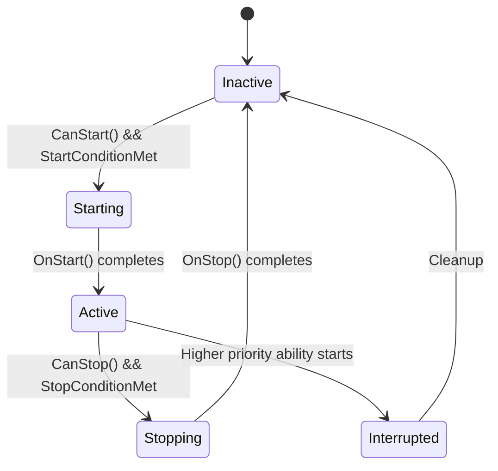

# EPIC 13.2: Ability System Architecture

> **Status:** NOT STARTED  
> **Priority:** HIGH  
> **Dependencies:** EPIC 1 (Character Controller)  
> **Reference:** `OPSIVE/.../Runtime/Character/Abilities/Ability.cs`

> [!IMPORTANT]
> **Architecture & Performance Requirements:**
> - **Server (Warrok_Server):** Ability state managed in ECS, runs in `PredictedSimulationSystemGroup`
> - **Client (Warrok_Client):** Animation triggers via hybrid bridge reading ability state
> - **Burst:** All ability systems Burst-compiled, use `IJobEntity` with `ScheduleParallel`
> - **NetCode:** `AbilityState` uses `[GhostField]` for active ability sync
> - **No managed types:** Ability definitions use blittable structs, no classes or references

## Overview

Create a modular ability system that allows abilities to be added, removed, and configured independently. This architecture enables rapid prototyping of new movement mechanics and clean separation of concerns.

### Why an Ability System?

Opsive's UCC handles 40+ abilities through a unified system:
- **Priority-based activation** - Higher priority abilities override lower ones
- **Start/Stop conditions** - Input, events, timers, states
- **Conflict resolution** - Abilities can block or allow others
- **State persistence** - Abilities maintain their own state

---

## Sub-Tasks

### 13.2.1 Ability Base Class
**Status:** NOT STARTED  
**Priority:** HIGH

Create the foundation for all abilities.

#### Core Ability Concept

```csharp
public struct AbilityState : IComponentData
{
    public int ActiveAbilityIndex; // -1 = none
    public int PendingAbilityIndex; // Queued ability
    public float AbilityStartTime;
    public float AbilityElapsedTime;
}

public struct AbilityDefinition : IBufferElementData
{
    public int AbilityTypeId; // Unique ID per ability type
    public int Priority; // Higher = takes precedence
    public bool IsActive;
    public bool CanStart;
    public bool CanStop;
    public float StartTime;
    public AbilityStartType StartType;
    public AbilityStopType StopType;
    
    // Conflict settings
    public int BlockedByMask; // Bitmask of abilities that block this
    public int BlocksMask; // Bitmask of abilities this blocks
}
```

#### Ability Lifecycle



#### System Architecture

```
AbilityStartConditionSystem (evaluates all start conditions)
    ↓
AbilityPriorityResolutionSystem (picks highest valid ability)
    ↓
AbilityActivationSystem (calls OnStart, transitions state)
    ↓
[Individual Ability Systems] (e.g., JumpAbilitySystem, SlideAbilitySystem)
    ↓
AbilityStopConditionSystem (evaluates stop conditions)
    ↓
AbilityDeactivationSystem (calls OnStop, cleanup)
```

#### Acceptance Criteria

- [ ] AbilityDefinition buffer stores all ability configs
- [ ] AbilityState tracks current/pending abilities
- [ ] Priority system resolves conflicts
- [ ] Abilities can be added/removed at runtime

---

### 13.2.2 Ability Starters
**Status:** NOT STARTED  
**Priority:** HIGH

Define how abilities are triggered.

#### Starter Types

```csharp
public enum AbilityStartType : byte
{
    Manual,           // Started via code
    InputDown,        // Button press
    InputHeld,        // Button held
    InputDoublePress, // Double-tap
    ButtonDownContinuous, // Held with repeat
    Automatic,        // Conditions checked each frame
    OnAnimatorEvent,  // Animation event triggers
}

public struct AbilityInputStarter : IComponentData
{
    public int AbilityIndex;
    public InputActionReference Action;
    public float DoubleTapWindow; // For InputDoublePress
    public float LastPressTime;
    public int PressCount;
}
```

#### Implementation

Each starter type has its own lightweight system:
- `InputDownStarterSystem` - Checks `Input.WasPressedThisFrame()`
- `InputHeldStarterSystem` - Checks `Input.IsPressed()`
- `AutomaticStarterSystem` - Calls `CanStart()` each frame

#### Acceptance Criteria

- [ ] Input-based starters work with new Input System
- [ ] Double-tap detection with configurable window
- [ ] Automatic abilities self-activate when conditions met

---

### 13.2.3 Ability Stoppers
**Status:** NOT STARTED  
**Priority:** HIGH

Define how abilities end.

#### Stopper Types

```csharp
public enum AbilityStopType : byte
{
    Manual,           // Stopped via code
    InputUp,          // Button released
    Duration,         // Fixed time limit
    OnAnimatorEvent,  // Animation event
    OnGrounded,       // When player lands
    OnNotGrounded,    // When player leaves ground
    Automatic,        // Conditions checked each frame
}

public struct AbilityDurationStopper : IComponentData
{
    public int AbilityIndex;
    public float Duration;
}
```

#### Acceptance Criteria

- [ ] InputUp stopper works reliably
- [ ] Duration stopper respects time scale
- [ ] Grounded/NotGrounded stoppers use physics

---

### 13.2.4 DetectObjectAbilityBase
**Status:** NOT STARTED  
**Priority:** MEDIUM

Pattern for abilities that require detecting nearby objects.

#### Algorithm

```
1. Each frame, raycast/overlap in detection area
2. Filter results by layer, tag, or component
3. Find "best" target (closest, highest priority, etc.)
4. Store target in ability state
5. Ability activates only if valid target exists
```

#### Application Examples

- Ladder detection
- Ledge grab detection
- Interactable detection
- Cover detection

#### Components

```csharp
public struct DetectObjectAbility : IComponentData
{
    public Entity DetectedTarget;
    public float3 DetectionOffset;
    public float DetectionRadius;
    public uint DetectionLayers;
    public int RequiredTag; // 0 = any
}
```

#### Acceptance Criteria

- [ ] Generic detection pattern works for multiple use cases
- [ ] Detection parameters are configurable
- [ ] Best target selection is customizable

---

### 13.2.5 DetectGroundAbilityBase
**Status:** NOT STARTED  
**Priority:** MEDIUM

Pattern for abilities that detect specific ground conditions.

#### Algorithm

```
1. Raycast downward from player
2. Check surface angle, material, layer
3. Determine if ground type matches ability requirements
4. Store surface info in ability state
```

#### Application Examples

- Slide (requires slope > X degrees)
- Prone (requires flat ground)
- Jump type selection (normal vs water jump)

#### Components

```csharp
public struct DetectGroundAbility : IComponentData
{
    public float3 GroundNormal;
    public float GroundAngle;
    public int SurfaceTypeId;
    public bool IsValidGround;
    public float MinAngle;
    public float MaxAngle;
}
```

#### Acceptance Criteria

- [ ] Ground angle detection accurate
- [ ] Surface type detection works with SurfaceSystem
- [ ] Configurable angle thresholds

---

### 13.2.6 StoredInputAbility
**Status:** NOT STARTED  
**Priority:** LOW

Buffer input for abilities that should queue.

#### Algorithm

```
1. When input received but ability can't start, store it
2. Check stored input each frame
3. If ability can now start, consume stored input
4. Expire stored input after timeout
```

#### Use Cases

- Jump buffering (press jump slightly before landing)
- Combo attacks (queue next attack during current)
- Roll out of stun (press during stun, executes on exit)

#### Components

```csharp
public struct StoredInput : IComponentData
{
    public int AbilityIndex;
    public float StoredTime;
    public float BufferDuration;
    public bool HasStoredInput;
}
```

#### Acceptance Criteria

- [ ] Input buffering works with configurable window
- [ ] Multiple abilities can have stored input
- [ ] Stored input expires correctly

---

## Files to Create

| File | Purpose |
|------|---------|
| `AbilityComponents.cs` | Core ability components |
| `AbilityStartConditionSystem.cs` | Evaluate start conditions |
| `AbilityStopConditionSystem.cs` | Evaluate stop conditions |
| `AbilityPriorityResolutionSystem.cs` | Pick active ability |
| `AbilityActivationSystem.cs` | Handle ability start |
| `AbilityDeactivationSystem.cs` | Handle ability stop |
| `InputStarterSystem.cs` | Input-based starters |
| `DetectObjectAbilitySystem.cs` | Object detection pattern |
| `DetectGroundAbilitySystem.cs` | Ground detection pattern |
| `StoredInputSystem.cs` | Input buffering |

## Designer Setup Guide

### Adding a New Ability

1. Create new AbilityTypeId constant
2. Add AbilityDefinition to player's buffer in authoring
3. Configure Priority, StartType, StopType
4. Create ability-specific system if needed
5. Add ability-specific components if needed

### Configuring Ability Priority

Lower number = lower priority. Suggested ranges:
- 0-99: Passive abilities (idle, movement)
- 100-199: Standard abilities (jump, crouch)
- 200-299: Special abilities (dodge, slide)
- 300-399: Override abilities (ragdoll, death)
