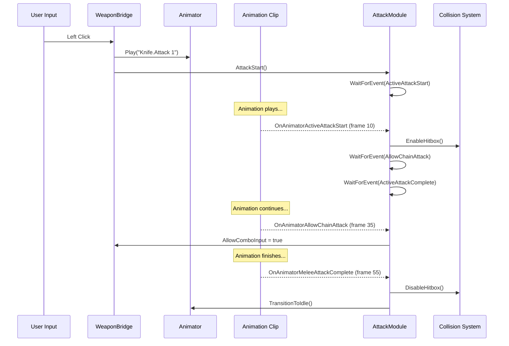

# EPIC 13.32 - Animation Event System Migration

## Status: 📋 PLANNED

---

## Overview

This document outlines the plan to migrate from exit-time-based animation transitions to a proper animation event system inspired by Opsive's architecture. This provides frame-precise control over animation states, hitbox activation, and combo chaining.

---

## Why Animation Events?

### Current Approach (Exit Time)
```
Attack Animation starts → Plays for X% → Exit Time triggers → Transition fires
```
**Issues**:
- Imprecise timing (hitbox doesn't match visual)
- Cannot interrupt at specific frames
- Combo windows are approximations
- Changing animation clips breaks timing

### Target Approach (Animation Events)
```
Attack Animation starts → Frame 10 fires "AttackStart" → Hitbox enables
                        → Frame 45 fires "AllowChain" → Accept combo input
                        → Frame 60 fires "AttackComplete" → Transition fires
```
**Benefits**:
- Frame-precise hitbox activation
- Designer-controlled timing via animation clips
- Combo windows can be early in animation
- Self-documenting (events are visible in clips)

---

## Opsive Architecture Analysis

### Core Classes

#### 1. `AnimationEventTrigger` (Base Class)
[AnimationEventTrigger.cs](file:///Users/dollerinho/Desktop/DIG/Assets/Opsive/com.opsive.ultimatecharactercontroller/Runtime/Utility/AnimationEventTrigger.cs)

**Purpose**: Manages timing for events via either:
- Unity Animation Events (frame-precise)
- Scheduled timer fallback (time-based)

```csharp
public class AnimationEventTrigger
{
    bool m_WaitForAnimationEvent;  // true = use animation event, false = use timer
    float m_Duration;               // Fallback timer duration
    
    void WaitForEvent();           // Start waiting for event
    void CancelWaitForEvent();     // Cancel waiting
    void NotifyEventListeners();   // Fire callbacks
}
```

**Key Insight**: Opsive always provides a timer fallback. If `WaitForAnimationEvent=false` or event never fires, the Duration timer triggers the callback instead.

---

#### 2. `AnimationSlotEventTrigger` (Slot-Aware)
Extends base to support per-weapon-slot events:

```csharp
public class AnimationSlotEventTrigger : AnimationEventTrigger
{
    int m_SlotID;  // Which weapon slot (0, 1, 2...)
    
    void RegisterUnregisterEvent(register, target, eventName, slotID, callback);
}
```

**Slot Event Pattern**:
- Generic event: `"OnAnimatorActiveAttackStart"` (any slot)
- Slot-specific: `"OnAnimatorActiveAttackStartSlot0"` (slot 0 only)

Both are registered, allowing global and slot-specific handling.

---

#### 3. Event Registration Flow

```csharp
// In AttackModule.cs
m_ActiveAttackStartEventTrigger.RegisterUnregisterEvent(
    register: true,                           // Registering (not unregistering)
    target: Character,                        // Event target (character GameObject)
    eventName: "OnAnimatorActiveAttackStart", // Event name to listen for
    slotID: SlotID,                          // Weapon slot (0, 1, 2)
    action: HandleActiveAttackStartAnimationEvent  // Callback
);
```

This registers for BOTH:
- `"OnAnimatorActiveAttackStart"` (global)
- `"OnAnimatorActiveAttackStartSlot0"` (slot-specific)

---

### Melee Attack Event Flow



---

### Key Events Per Weapon Type

#### Melee Weapons (Knife/Katana/Sword)
| Event | Purpose | Typical Timing |
|-------|---------|----------------|
| `OnAnimatorActiveAttackStart` | Enable hitbox, start collision checks | ~10-20% |
| `OnAnimatorAllowChainAttack` | Allow combo input window | ~50-70% |
| `OnAnimatorMeleeAttackComplete` | Disable hitbox, allow transition | ~90% |

#### Shootable Weapons (Guns)
| Event | Purpose | Typical Timing |
|-------|---------|----------------|
| `OnAnimatorItemUse` | Fire bullet, spawn muzzle flash | Immediate |
| `OnAnimatorItemUseComplete` | Allow next shot | After recoil |
| `OnAnimatorItemReload` | Detach magazine | ~30% |
| `OnAnimatorItemReloadComplete` | Reattach magazine, restore ammo | ~90% |

#### Bow
| Event | Purpose | Typical Timing |
|-------|---------|----------------|
| `OnAnimatorItemUse` | Release arrow | On release |
| `OnAnimatorItemUseComplete` | Return to aim/idle | After release |

#### Equip/Unequip (All Weapons)
| Event | Purpose | Typical Timing |
|-------|---------|----------------|
| `OnAnimatorItemEquip` | Attach weapon to hand | ~30% |
| `OnAnimatorItemEquipComplete` | Ready for use | ~90% |
| `OnAnimatorItemUnequip` | Start putting away | ~10% |
| `OnAnimatorItemUnequipComplete` | Detach weapon | ~90% |

---

## Implementation Plan

### Phase 1: Event Infrastructure

#### Task 13.32.1 - Create AnimationEventDispatcher
A MonoBehaviour that receives Unity Animation Events and dispatches them via our event system.

```csharp
// File: Assets/Scripts/Animation/AnimationEventDispatcher.cs
public class AnimationEventDispatcher : MonoBehaviour
{
    private GameObject _character;
    
    public void OnAnimatorActiveAttackStart() 
    {
        EventHandler.ExecuteEvent(_character, "OnAnimatorActiveAttackStart");
    }
    
    public void OnAnimatorMeleeAttackComplete() 
    {
        EventHandler.ExecuteEvent(_character, "OnAnimatorMeleeAttackComplete");
    }
    
    // ... etc for all events
}
```

**Attach to**: Character Animator's root GameObject

---

#### Task 13.32.2 - Create AnimationEventReceiver
A simplified version of Opsive's `AnimationEventTrigger` for our ECS bridge.

```csharp
// File: Assets/Scripts/Animation/AnimationEventReceiver.cs
public class AnimationEventReceiver
{
    public event Action OnTriggered;
    public bool IsWaiting { get; private set; }
    
    private float _fallbackTimer;
    private float _fallbackDuration;
    
    public void StartWaiting(float fallbackDuration = 0.5f)
    {
        IsWaiting = true;
        _fallbackTimer = 0f;
        _fallbackDuration = fallbackDuration;
    }
    
    public void Update(float deltaTime)
    {
        if (!IsWaiting) return;
        _fallbackTimer += deltaTime;
        if (_fallbackTimer >= _fallbackDuration)
            Trigger();
    }
    
    public void Trigger()
    {
        if (!IsWaiting) return;
        IsWaiting = false;
        OnTriggered?.Invoke();
    }
}
```

---

#### Task 13.32.3 - Integrate with WeaponEquipVisualBridge
Add event receivers for each action type.

```csharp
private AnimationEventReceiver _attackStartEvent = new();
private AnimationEventReceiver _attackCompleteEvent = new();
private AnimationEventReceiver _allowChainEvent = new();

private void OnEnable()
{
    _attackStartEvent.OnTriggered += OnAttackStart;
    _attackCompleteEvent.OnTriggered += OnAttackComplete;
    _allowChainEvent.OnTriggered += OnAllowChain;
    
    EventHandler.RegisterEvent(gameObject, "OnAnimatorActiveAttackStart", _attackStartEvent.Trigger);
    EventHandler.RegisterEvent(gameObject, "OnAnimatorMeleeAttackComplete", _attackCompleteEvent.Trigger);
    EventHandler.RegisterEvent(gameObject, "OnAnimatorAllowChainAttack", _allowChainEvent.Trigger);
}

private void OnAttackStart()
{
    _hitboxActive = true;
    // Start collision checks
}

private void OnAllowChain()
{
    _canChainAttack = true;
}

private void OnAttackComplete()
{
    _hitboxActive = false;
    _isAttacking = false;
}
```

---

### Phase 2: Animation Clip Events

#### Task 13.32.4 - Add Events to Knife Animation Clips
For each Knife attack animation (`Attack 1 Light From Idle`, etc.):

1. Open Animation window with clip selected
2. Add Animation Event at ~15% mark: `OnAnimatorActiveAttackStart`
3. Add Animation Event at ~50% mark: `OnAnimatorAllowChainAttack`
4. Add Animation Event at ~90% mark: `OnAnimatorMeleeAttackComplete`

**Animation Event Inspector Settings**:
- Function: Event name (e.g., `OnAnimatorActiveAttackStart`)
- Float, Int, String: Leave empty (dispatcher handles routing)

---

#### Task 13.32.5 - Add Events to Katana/Sword Clips
Same process for all melee weapon clips.

---

#### Task 13.32.6 - Add Events to Bow Clips
For bow animations:
- `OnAnimatorItemUse` - Arrow release frame
- `OnAnimatorItemUseComplete` - End of release animation

---

#### Task 13.32.7 - Add Events to Gun Clips
For reload animations:
- `OnAnimatorItemReload` - Magazine detach frame
- `OnAnimatorItemReloadComplete` - Magazine attach frame

For fire animations:
- `OnAnimatorItemUse` - Muzzle flash frame
- `OnAnimatorItemUseComplete` - Return to ready

---

### Phase 3: Remove Exit Time Transitions

#### Task 13.32.8 - Update Animator Controller
After events are working:
1. Disable "Has Exit Time" on attack transitions
2. Change transition conditions to check our event-set parameters
3. Verify animations don't prematurely exit

---

### Phase 4: ECS Integration

#### Task 13.32.9 - Add MeleeHitboxSystem
ECS system that checks for collisions when hitbox is active:

```csharp
[UpdateInGroup(typeof(SimulationSystemGroup))]
public partial struct MeleeHitboxSystem : ISystem
{
    public void OnUpdate(ref SystemState state)
    {
        foreach (var (meleeState, transform, weapon) in 
            SystemAPI.Query<RefRW<MeleeState>, LocalTransform, WeaponReference>())
        {
            if (!meleeState.ValueRO.HitboxActive) continue;
            
            // Physics overlap check
            var hits = Physics.OverlapSphere(transform.Position, weapon.HitboxRadius);
            foreach (var hit in hits)
            {
                // Apply damage...
            }
        }
    }
}
```

---

## Event Naming Convention

Follow Opsive's naming pattern for compatibility:

```
OnAnimator{Action}{Timing}[Slot{N}]
```

Examples:
- `OnAnimatorActiveAttackStart` - Attack hitbox activates
- `OnAnimatorActiveAttackStartSlot0` - Same, but slot-specific
- `OnAnimatorMeleeAttackComplete` - Attack ends
- `OnAnimatorItemUse` - Generic item use (fire, swing)
- `OnAnimatorItemUseComplete` - Item use ends
- `OnAnimatorItemReload` - Reload starts detaching
- `OnAnimatorItemReloadComplete` - Reload finishes
- `OnAnimatorItemEquip` - Equip animation mid-point
- `OnAnimatorItemEquipComplete` - Equip finishes
- `OnAnimatorItemUnequip` - Unequip starts
- `OnAnimatorItemUnequipComplete` - Unequip finishes
- `OnAnimatorAllowChainAttack` - Combo window opens

---

## Fallback Timer Values

Conservative defaults if animation events don't fire:

| Event | Fallback Duration |
|-------|-------------------|
| AttackStart | 0.15s |
| AttackComplete | 0.4s |
| AllowChainAttack | 0.25s |
| ItemUse | 0.2s |
| ItemUseComplete | 0.3s |
| Reload | 0.3s |
| ReloadComplete | 1.5s |
| Equip | 0.3s |
| EquipComplete | 0.5s |
| Unequip | 0.3s |
| UnequipComplete | 0.5s |

---

## Testing Checklist

### Melee
- [ ] Knife: Attack 1 hitbox activates at correct frame
- [ ] Knife: Attack 2 chains when input during window
- [ ] Knife: Attack completes naturally without early exit
- [ ] Katana: 3-hit combo works with proper timing
- [ ] Sword: 2-hit combo works

### Ranged
- [ ] Bow: Arrow releases at draw complete
- [ ] Bow: Can't fire until draw complete
- [ ] Gun: Muzzle flash syncs with animation
- [ ] Gun: Reload swaps magazine at correct frame

### Transitions
- [ ] Equip: Weapon appears at correct frame
- [ ] Unequip: Weapon disappears at correct frame
- [ ] Interrupt: Equip can be interrupted by damage

---

## Dependencies

| Dependency | Status |
|------------|--------|
| Opsive EventHandler system | ✅ Available |
| Animation clips with proper structure | ✅ Exist |
| WeaponEquipVisualBridge | ✅ Working |
| MeleeState ECS component | ✅ Defined |

---

## References

- [AnimationEventTrigger.cs](file:///Users/dollerinho/Desktop/DIG/Assets/Opsive/com.opsive.ultimatecharactercontroller/Runtime/Utility/AnimationEventTrigger.cs)
- [AttackModule.cs](file:///Users/dollerinho/Desktop/DIG/Assets/Opsive/com.opsive.ultimatecharactercontroller/Runtime/Items/Actions/Modules/Melee/AttackModule.cs)
- [ReloaderModule.cs](file:///Users/dollerinho/Desktop/DIG/Assets/Opsive/com.opsive.ultimatecharactercontroller/Runtime/Items/Actions/Modules/Shootable/ReloaderModule.cs)
- [EPIC13.29](file:///Users/dollerinho/Desktop/DIG/Docs/EPIC13/EPIC13.29.md) - Melee Weapon Migration (current approach)
