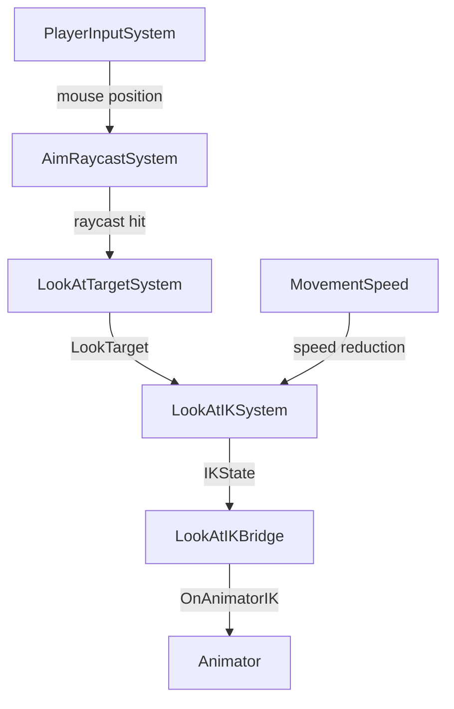

# EPIC 13.4: IK System

> **Status:** NOT STARTED  
> **Priority:** MEDIUM  
> **Dependencies:** EPIC 1 (Character Controller)  
> **Reference:** `OPSIVE/.../Runtime/Character/CharacterIK.cs` (70KB)

> [!IMPORTANT]
> **Architecture & Performance Requirements:**
> - **Server (Warrok_Server):** IK targets/weights calculated in ECS (foot positions, aim direction)
> - **Client (Warrok_Client):** IK applied via `OnAnimatorIK()` in `IKBridge` MonoBehaviour
> - **Hybrid Required:** Unity's IK API requires MonoBehaviour - use bridge pattern
> - **NetCode:** Only replicate `AimDirection` for look-at IK; foot IK is client-only
> - **Burst:** IK weight/target calculation systems are Burst-compiled, actual IK application is not

## Overview

Implement Inverse Kinematics for visually polishing character animations. IK makes characters feel grounded and connected to the world.

---

## Sub-Tasks

### 13.4.1 Foot Placement IK
**Status:** NOT STARTED  
**Priority:** HIGH

Feet conform to uneven terrain.

#### Algorithm (from Opsive)

```
1. For each foot:
   - Raycast down from hip bone position
   - Find ground contact point
   - Calculate height offset from default foot height
   - Apply IK position: FootBone.position + GroundOffset
   - Calculate ground normal for foot rotation
   - Apply IK rotation to align foot with ground

2. Body height adjustment:
   - Find lowest foot offset
   - Lower entire body to keep feet grounded
   - Blend with animation height
```

#### Components

```csharp
public struct FootIKSettings : IComponentData
{
    public float FootRayLength; // 0.5m
    public float FootOffset; // 0.1m (distance from ground)
    public float BodyHeightAdjustment; // Max body lower amount
    public float FootIKWeight;
    public float BodyIKWeight;
    public float BlendSpeed; // How fast IK adapts
}

public struct FootIKState : IComponentData
{
    public float3 LeftFootTarget;
    public float3 RightFootTarget;
    public quaternion LeftFootRotation;
    public quaternion RightFootRotation;
    public float LeftFootWeight;
    public float RightFootWeight;
    public float BodyOffset;
}
```

#### Hybrid Bridge

```csharp
// FootIKBridge.cs (MonoBehaviour)
void OnAnimatorIK(int layerIndex)
{
    // Read FootIKState from ECS
    // Apply via:
    animator.SetIKPosition(AvatarIKGoal.LeftFoot, leftFootTarget);
    animator.SetIKPositionWeight(AvatarIKGoal.LeftFoot, leftFootWeight);
    animator.SetIKRotation(AvatarIKGoal.LeftFoot, leftFootRotation);
    animator.SetIKRotationWeight(AvatarIKGoal.LeftFoot, leftFootWeight);
}
```

#### Acceptance Criteria

- [ ] Feet contact ground on slopes
- [ ] Feet adjust on stairs
- [ ] Body lowers appropriately
- [ ] Smooth blending during movement
- [ ] IK disabled during jumps/falls

---

### 13.4.2 Look-At IK (Aim-While-Moving)
**Status:** NOT STARTED  
**Priority:** HIGH

Head and spine track the mouse/aim direction while body moves independently. This is the feature where you're running in one direction but your character's upper body turns to look where you're aiming.

#### Use Cases

- **Third-Person Shooters:** Character runs left but aims right
- **Strafe-Aiming:** Moving sideways while keeping crosshair on target
- **Exploration:** Head tracks interesting objects as you pass
- **NPC AI:** Look at player during conversation

#### Algorithm (Mouse Aim Tracking)

```
1. Get aim point from mouse:
   - Raycast from camera through screen center (crosshair position)
   - If hit: use hit point as LookTarget
   - If no hit: use point at MaxAimDistance along ray

2. Calculate body-relative aim angle:
   - toTarget = normalize(LookTarget - HeadPosition)
   - bodyForward = character forward direction
   - horizontalAngle = SignedAngle(bodyForward, toTarget, up)
   - verticalAngle = Angle between horizontal plane and toTarget

3. Distribute rotation across spine chain:
   - If |horizontalAngle| <= MaxHeadAngle:
       - Head handles all rotation
   - Else:
       - Spine upper handles overflow * SpineUpperRatio
       - Spine lower handles overflow * SpineLowerRatio
       - Clamp total to MaxTotalAngle

4. Apply IK:
   - animator.SetLookAtPosition(LookTarget)
   - animator.SetLookAtWeight(headWeight, bodyWeight, headWeight, eyeWeight, clampWeight)

5. During locomotion:
   - Reduce LookAt weight at high speeds (optional)
   - Add subtle lag for realism (head catches up to aim)
```

#### Components

```csharp
public struct LookAtIKSettings : IComponentData
{
    // Angle limits
    public float MaxHeadAngle;       // 60 degrees - head only
    public float MaxSpineAngle;      // 30 degrees - additional from spine
    public float MaxTotalAngle;      // 80 degrees - absolute max
    public float MaxVerticalAngle;   // 45 degrees up/down
    
    // Weight distribution
    public float HeadWeight;         // 1.0
    public float BodyWeight;         // 0.3 (spine contribution)
    public float EyesWeight;         // 0.5
    public float ClampWeight;        // 0.5 (reduce at extremes)
    
    // Behavior
    public float BlendSpeed;         // 10 - how fast to reach target
    public float AimLagAmount;       // 0.1 - slight delay for realism
    public float SpeedReductionStart; // 5 m/s - reduce weight above this speed
    public float SpeedReductionEnd;   // 10 m/s - zero weight above this
    public float MaxAimDistance;      // 100m - raycast distance
    
    // Mode
    public LookAtMode Mode;
}

public enum LookAtMode : byte
{
    MouseAim,        // Always track crosshair
    NearestEnemy,    // Auto-track closest enemy
    InterestPoint,   // Track interesting objects
    Manual,          // Scripted target
    Disabled
}

public struct LookAtIKState : IComponentData
{
    public float3 LookTarget;        // World position to look at
    public float3 SmoothedTarget;    // Lag-smoothed target
    public float CurrentWeight;      // Current blend weight
    public float TargetWeight;       // Target blend weight
    public bool HasTarget;
    public float CurrentHorizontalAngle; // For debugging
    public float CurrentVerticalAngle;
}

// For multiplayer: replicate aim direction
public struct AimDirection : IComponentData
{
    [GhostField] public float3 AimPoint;
    [GhostField] public float2 AimAngles; // Pitch, Yaw relative to body
}
```

#### Hybrid Bridge Implementation

```csharp
// LookAtIKBridge.cs (MonoBehaviour)
public class LookAtIKBridge : MonoBehaviour
{
    private Animator animator;
    private Entity playerEntity;
    
    // Cached from ECS
    private float3 lookTarget;
    private float headWeight, bodyWeight, eyesWeight, clampWeight;
    
    void OnAnimatorIK(int layerIndex)
    {
        if (layerIndex != 0) return; // Only base layer
        
        // Read state from ECS
        ReadFromECS();
        
        if (headWeight > 0.01f)
        {
            animator.SetLookAtPosition(lookTarget);
            animator.SetLookAtWeight(
                headWeight,   // Overall weight
                bodyWeight,   // Body weight (spine rotation)
                headWeight,   // Head weight
                eyesWeight,   // Eyes weight
                clampWeight   // Clamp weight (reduce at extremes)
            );
        }
    }
}
```

#### System Pipeline



#### ECS System Example

```csharp
[BurstCompile]
public partial struct LookAtIKSystem : ISystem
{
    public void OnUpdate(ref SystemState state)
    {
        var deltaTime = SystemAPI.Time.DeltaTime;
        
        foreach (var (settings, ikState, aimDir, velocity) 
            in SystemAPI.Query<RefRO<LookAtIKSettings>, 
                              RefRW<LookAtIKState>,
                              RefRO<AimDirection>,
                              RefRO<PhysicsVelocity>>())
        {
            // 1. Update smoothed target (adds lag)
            ikState.ValueRW.SmoothedTarget = math.lerp(
                ikState.ValueRO.SmoothedTarget,
                aimDir.ValueRO.AimPoint,
                deltaTime * (1f / math.max(0.01f, settings.ValueRO.AimLagAmount))
            );
            
            // 2. Calculate weight based on speed
            float speed = math.length(velocity.ValueRO.Linear);
            float speedFactor = 1f - math.saturate(
                (speed - settings.ValueRO.SpeedReductionStart) / 
                (settings.ValueRO.SpeedReductionEnd - settings.ValueRO.SpeedReductionStart)
            );
            
            ikState.ValueRW.TargetWeight = settings.ValueRO.HeadWeight * speedFactor;
            
            // 3. Blend current weight
            ikState.ValueRW.CurrentWeight = math.lerp(
                ikState.ValueRO.CurrentWeight,
                ikState.ValueRO.TargetWeight,
                deltaTime * settings.ValueRO.BlendSpeed
            );
            
            ikState.ValueRW.LookTarget = ikState.ValueRO.SmoothedTarget;
            ikState.ValueRW.HasTarget = true;
        }
    }
}
```

#### Acceptance Criteria

- [ ] Head turns toward mouse/crosshair position
- [ ] Spine contributes to large angle turns (running left, aiming right)
- [ ] Smooth transitions when aim moves
- [ ] No over-rotation at extremes (head doesn't twist off)
- [ ] Subtle lag for natural feel
- [ ] Weight reduces at high movement speeds
- [ ] Works with NetCode (aim direction replicated)
- [ ] Works during all locomotion states (walk, run, strafe)

#### Designer Tuning Guide

| Setting | Natural/Realistic | Snappy/Arcade |
|---------|-------------------|---------------|
| BlendSpeed | 6 | 15 |
| AimLagAmount | 0.15 | 0.05 |
| MaxHeadAngle | 55° | 70° |
| MaxTotalAngle | 75° | 90° |
| BodyWeight | 0.2 | 0.4 |

**Common Issues:**
- **Head snaps too fast:** Increase AimLagAmount
- **Not looking far enough:** Increase MaxTotalAngle
- **Looks robotic:** Lower weights, increase lag
- **Head jitters:** Lower BlendSpeed
- **Doesn't work while running:** Check SpeedReductionStart/End values

---

### 13.4.3 Hand IK Framework
**Status:** NOT STARTED  
**Priority:** MEDIUM

Hands grip weapons and objects correctly.

#### Use Cases

- Two-handed weapon grip
- Object interaction (door handles, ladders)
- Cover system hand placement
- Vehicle steering wheel

#### Algorithm

```
1. Dominant hand follows animation
2. Secondary hand IK to weapon/object target
3. Blend based on item type:
   - Rifle: strong secondary hand IK
   - Pistol: weak secondary hand IK
   - No weapon: no IK
```

#### Components

```csharp
public struct HandIKSettings : IComponentData
{
    public float LeftHandWeight;
    public float RightHandWeight;
    public float BlendSpeed;
}

public struct HandIKTarget : IComponentData
{
    public Entity TargetEntity;
    public float3 TargetPosition;
    public quaternion TargetRotation;
    public float Weight;
}
```

#### Acceptance Criteria

- [ ] Offhand grips weapon correctly
- [ ] Hand positions blend smoothly
- [ ] Works with item equip/unequip

---

### 13.4.4 IK Weight Blending
**Status:** NOT STARTED  
**Priority:** MEDIUM

Smooth transitions for all IK systems.

#### Scenarios

- Blend in when landing
- Blend out when jumping
- Blend out during animations that handle IK themselves
- Blend based on movement speed

#### Components

```csharp
public struct IKBlendState : IComponentData
{
    public float TargetWeight;
    public float CurrentWeight;
    public float BlendSpeed;
    public IKBlendMode Mode;
}

public enum IKBlendMode : byte
{
    Constant,
    SpeedBased, // Less IK at high speeds
    GroundedBased, // IK only when grounded
    Custom
}
```

#### Acceptance Criteria

- [ ] No IK popping during transitions
- [ ] Speed-based blending works
- [ ] Grounded-based blending works

---

### 13.4.5 CapsuleCollider Positioner
**Status:** NOT STARTED  
**Priority:** LOW

Dynamic collider adjustment based on animation.

#### Use Cases

- Collider shrinks during crouch
- Collider adjusts during roll
- Collider offsets during lean

#### Algorithm

```
1. Read desired collider params from animation curves
2. Blend from current to target over time
3. Check for obstacles before shrinking
4. Grow back when animation allows
```

#### Components

```csharp
public struct DynamicCapsule : IComponentData
{
    public float TargetHeight;
    public float TargetRadius;
    public float3 TargetCenter;
    public float BlendSpeed;
}
```

#### Acceptance Criteria

- [ ] Collider adjusts with animation
- [ ] No clipping during adjustment
- [ ] Smooth transitions

---

## Files to Create

| File | Purpose |
|------|---------|
| `IKComponents.cs` | All IK-related components |
| `FootIKSystem.cs` | Calculate foot ground positions |
| `LookAtIKSystem.cs` | Calculate look targets |
| `HandIKSystem.cs` | Calculate hand targets |
| `IKBlendSystem.cs` | Blend weight management |
| `IKBridge.cs` | MonoBehaviour applying IK via Animator |
| `DynamicCapsuleSystem.cs` | Collider adjustment |
| `IKAuthoring.cs` | Inspector configuration |

## Designer Setup Guide

### Foot IK Tuning

| Setting | Indoor/Smooth | Outdoor/Rough |
|---------|--------------|---------------|
| FootRayLength | 0.4m | 0.6m |
| FootOffset | 0.08m | 0.1m |
| BodyHeightAdjustment | 0.15m | 0.3m |
| BlendSpeed | 8 | 5 |

### Common Issues

- **Feet jitter:** Lower BlendSpeed, increase raycast frequency
- **Feet clip through ground:** Increase FootOffset
- **Body bobs too much:** Lower BodyHeightAdjustment
- **IK looks robotic:** Lower IK weights
