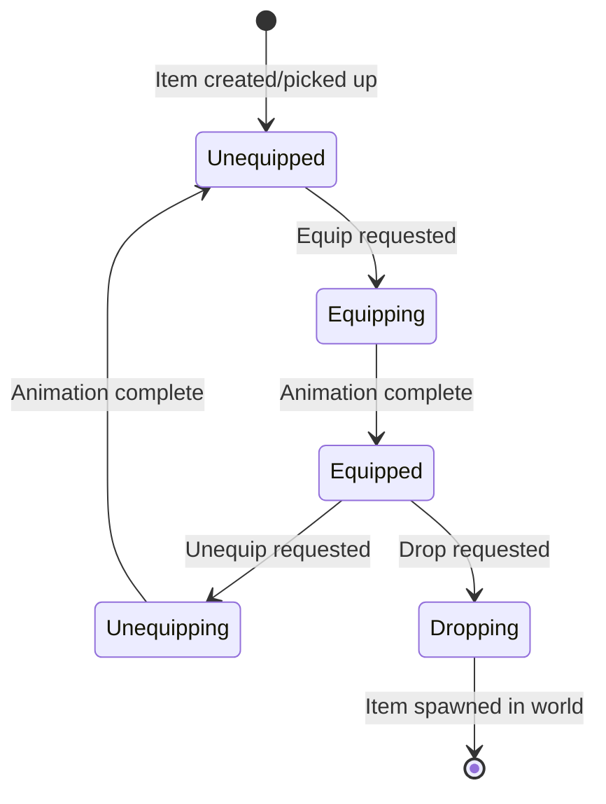

# EPIC 13.6: Items & Inventory Framework

> **Status:** IMPLEMENTED ✓
> **Priority:** LOW  
> **Dependencies:** EPIC 13.2 (Ability System)  
> **Reference:** `OPSIVE/.../Runtime/Items/CharacterItem.cs` (65KB)

> [!IMPORTANT]
> **Architecture & Performance Requirements:**
> - **Server (Warrok_Server):** Inventory state, item ownership, equip state managed server-side
> - **Client (Warrok_Client):** Viewmodel visuals, equip animations via hybrid bridges
> - **NetCode:** `CharacterItem.State` and `Inventory` replicated with `[GhostField]`
> - **Burst:** Item systems Burst-compiled, inventory operations use `ScheduleParallel`
> - **Entity references:** Use `Entity` for item slots, not managed references

## Overview

Create the foundation for equippable items including weapons, tools, and consumables. This framework enables item-based gameplay.

---

## Sub-Tasks

### 13.6.1 CharacterItem Base
**Status:** NOT STARTED  
**Priority:** HIGH

Core item component and slot system.

#### Data Structures

```csharp
public struct ItemSlot : IBufferElementData
{
    public int SlotId;
    public Entity ItemEntity;
    public bool IsEmpty => ItemEntity == Entity.Null;
}

public struct CharacterItem : IComponentData
{
    public int ItemTypeId;
    public int SlotId;
    public Entity OwnerEntity;
    public ItemState State; // Unequipped, Equipping, Equipped, Unequipping
    public float StateTime;
}

public enum ItemState : byte
{
    Unequipped,
    Equipping,
    Equipped,
    Unequipping,
    Dropping
}
```

#### Item Lifecycle



#### Acceptance Criteria

- [ ] Items can be equipped to slots
- [ ] Items track their owner
- [ ] Item state machine works correctly
- [ ] Multiple slots supported (primary, secondary, etc.)

---

### 13.6.2 Inventory System
**Status:** NOT STARTED  
**Priority:** HIGH

Slot management, stacking, and categories.

#### Components

```csharp
public struct Inventory : IComponentData
{
    public int MaxSlots;
    public int UsedSlots;
}

public struct InventoryItem : IBufferElementData
{
    public int ItemTypeId;
    public int Quantity;
    public int SlotIndex;
    public int MaxStack;
    public FixedString32Bytes Category; // "Weapon", "Ammo", "Consumable"
}

public struct InventorySettings : IComponentData
{
    public int WeaponSlots;
    public int ConsumableSlots;
    public int AmmoSlots;
    public bool AllowDuplicates;
}
```

#### Operations

- **Add:** Find empty slot, add item
- **Remove:** Clear slot, drop or destroy
- **Stack:** Add to existing stack if same type
- **Swap:** Exchange items between slots
- **Move:** Transfer between inventories

#### Acceptance Criteria

- [ ] Items stored in inventory
- [ ] Stacking works for stackable items
- [ ] Categories organize items
- [ ] Inventory limits enforced

---

### 13.6.3 ItemEquipVerifier
**Status:** NOT STARTED  
**Priority:** MEDIUM

Animation-synced equip/unequip.

#### Algorithm

```
1. On equip request:
   - If current item equipped, queue unequip first
   - Start unequip animation
   - Wait for animation complete (or event)
   - Disable current item visuals
2. Start equip animation for new item
3. Wait for animation complete
4. Enable new item visuals
5. Set item state to Equipped
```

#### Components

```csharp
public struct EquipRequest : IComponentData
{
    public Entity ItemEntity;
    public int SlotId;
    public bool Pending;
}

public struct EquipAnimationState : IComponentData
{
    public float EquipDuration;
    public float UnequipDuration;
    public float CurrentTime;
    public bool IsEquipping;
    public bool IsUnequipping;
}
```

#### Acceptance Criteria

- [ ] Equip respects animation timing
- [ ] Unequip plays before new equip
- [ ] No instant item swapping
- [ ] Animation events can trigger item visibility

---

### 13.6.4 PerspectiveItem
**Status:** NOT STARTED  
**Priority:** MEDIUM

First-person viewmodel vs third-person worldmodel.

#### Concept

Items can have two visual representations:
- **First Person:** Viewmodel arms + weapon (visible to local player)
- **Third Person:** Full character + weapon (visible to others)

#### Components

```csharp
public struct PerspectiveItem : IComponentData
{
    public Entity FirstPersonVisual;
    public Entity ThirdPersonVisual;
    public bool IsFirstPerson;
}

public struct ViewmodelOffset : IComponentData
{
    public float3 Position;
    public quaternion Rotation;
    public float FOV;
}
```

#### Acceptance Criteria

- [ ] Local player sees viewmodel
- [ ] Remote players see worldmodel
- [ ] Smooth transitions when switching perspective

---

### 13.6.5 ItemPickup System
**Status:** NOT STARTED  
**Priority:** MEDIUM

Collect items from world.

#### Algorithm

```
1. Detect item pickup collider (trigger or raycast)
2. Check inventory space
3. Transfer item to inventory
4. Destroy or disable world pickup
5. Play pickup VFX/SFX
```

#### Components

```csharp
public struct ItemPickup : IComponentData
{
    public int ItemTypeId;
    public int Quantity;
    public float PickupRadius;
    public bool RequiresInteraction; // vs auto-pickup
}

public struct PickupEvent : IComponentData
{
    public Entity PickupEntity;
    public Entity PlayerEntity;
    public bool Pending;
}
```

#### Acceptance Criteria

- [ ] Walk over pickups to collect
- [ ] Interaction-based pickups work
- [ ] Full inventory prevents pickup
- [ ] Pickup feedback (sound, VFX)

---

## Files to Create

| File | Purpose |
|------|---------|
| `ItemComponents.cs` | Core item components |
| `InventoryComponents.cs` | Inventory components |
| `ItemEquipSystem.cs` | Equip/unequip logic |
| `InventorySystem.cs` | Inventory management |
| `ItemPickupSystem.cs` | World pickup collection |
| `ItemVisualsSystem.cs` | Show/hide items |
| `PerspectiveItemSystem.cs` | Viewmodel/worldmodel switching |
| `ItemAuthoring.cs` | Item prefab authoring |
| `InventoryAuthoring.cs` | Character inventory setup |

## Designer Setup Guide

### Creating Item Prefabs

1. Create prefab with `ItemAuthoring`
2. Set ItemTypeId (unique per item type)
3. Configure slot compatibility
4. Add visual meshes/renderers
5. Optional: Add FirstPerson/ThirdPerson variants

### Inventory Configuration

| Character Type | Weapon Slots | Consumable Slots |
|---------------|--------------|------------------|
| Player | 2 | 4 |
| NPC | 1 | 0 |
| Vehicle | 0 | 0 |
