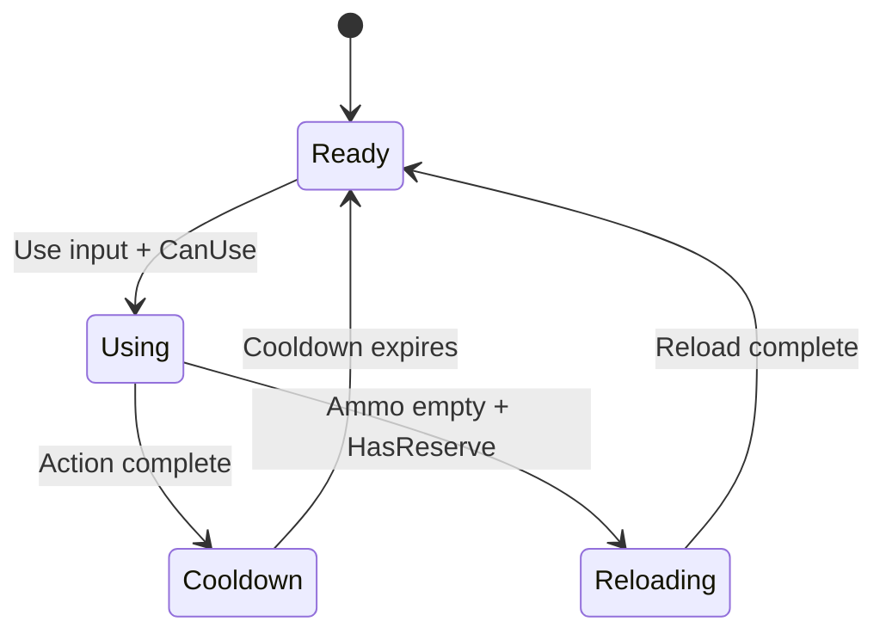

# EPIC 13.7: Weapons Framework

> **Status:** IMPLEMENTED ✓
> **Priority:** LOW  
> **Dependencies:** EPIC 13.6 (Items & Inventory)  
> **Reference:** `OPSIVE/.../Runtime/Items/Actions/`

> [!IMPORTANT]
> **Architecture & Performance Requirements:**
> - **Server (Warrok_Server):** Weapon state, ammo, fire events run in `PredictedSimulationSystemGroup`
> - **Client (Warrok_Client):** Muzzle flash, recoil camera shake, audio via bridges
> - **NetCode:** Projectiles spawned server-side, position replicated; hitscan via RPC
> - **Burst:** Projectile movement, hit detection fully Burst-compiled
> - **Prediction:** Client-side prediction for fire events, server reconciliation for hits

## Overview

Implement weapon action types for combat gameplay. Each action type handles a category of weapons with shared behavior.

---

## Sub-Tasks

### 13.7.1 UsableAction Base
**Status:** NOT STARTED  
**Priority:** HIGH

Generic base for all usable item actions.

#### Components

```csharp
public struct UsableAction : IComponentData
{
    public UsableActionType ActionType;
    public bool CanUse;
    public bool IsUsing;
    public float UseTime;
    public float CooldownRemaining;
    public int AmmoCount;
    public int ClipSize;
}

public enum UsableActionType : byte
{
    None,
    Shootable,
    Melee,
    Throwable,
    Magic,
    Shield
}

public struct UseRequest : IComponentData
{
    public bool StartUse;
    public bool StopUse;
    public float3 AimPoint;
}
```

#### Action Lifecycle



#### Acceptance Criteria

- [ ] Actions track use state
- [ ] Cooldown prevents spam
- [ ] Ammo tracked correctly
- [ ] Reload triggers when empty

---

### 13.7.2 ShootableAction
**Status:** NOT STARTED  
**Priority:** HIGH

Firearms with reloading, recoil, and spread.

#### Algorithm

```
1. On fire input:
   - Check ammo > 0, cooldown == 0
   - Apply recoil to camera/aim
   - Add spread to aim direction
   - Raycast or spawn projectile
   - Play fire VFX/SFX
   - Decrement ammo
   - Start cooldown
2. On reload input:
   - Check has reserve ammo
   - Play reload animation
   - Wait for reload time
   - Transfer ammo from reserve to clip
```

#### Components

```csharp
public struct ShootableAction : IComponentData
{
    public float FireRate; // Rounds per second
    public float Damage;
    public float Range;
    public float SpreadAngle;
    public float RecoilAmount;
    public float RecoilRecovery;
    public float ReloadTime;
    public bool IsAutomatic;
    public bool UseHitscan; // vs projectile
}

public struct ShootableState : IComponentData
{
    public float CurrentSpread;
    public float CurrentRecoil;
    public float TimeSinceLastShot;
    public bool IsFiring;
    public bool IsReloading;
    public float ReloadProgress;
}

public struct RecoilState : IComponentData
{
    public float2 CurrentRecoil; // Pitch, Yaw offset
    public float2 RecoilVelocity;
    public float RecoverySpeed;
}
```

#### Acceptance Criteria

- [ ] Hitscan weapons work
- [ ] Projectile weapons work
- [ ] Recoil affects aim
- [ ] Spread increases with fire
- [ ] Reload animation plays

---

### 13.7.3 MeleeAction
**Status:** NOT STARTED  
**Priority:** HIGH

Melee weapons with hitbox timing.

#### Algorithm

```
1. On attack input:
   - Start attack animation
   - Enable hitbox at animation time T1
   - Disable hitbox at animation time T2
   - Track hits during active hitbox
   - Apply damage to hit targets
   - Prevent duplicate hits same swing
```

#### Components

```csharp
public struct MeleeAction : IComponentData
{
    public float Damage;
    public float Range;
    public float AttackSpeed;
    public float HitboxActiveStart; // Normalized time
    public float HitboxActiveEnd;
    public int ComboCount;
    public float ComboWindow;
}

public struct MeleeState : IComponentData
{
    public int CurrentCombo;
    public float AttackTime;
    public bool HitboxActive;
    public bool HasHitThisSwing;
}

public struct MeleeHitbox : IComponentData
{
    public float3 Offset;
    public float3 Size; // Box dimensions
    public bool IsActive;
}
```

#### Acceptance Criteria

- [ ] Hitbox activates during animation window
- [ ] Damage applies to hit targets
- [ ] Combos chain with timing
- [ ] No duplicate hits per swing

---

### 13.7.4 ThrowableAction
**Status:** NOT STARTED  
**Priority:** MEDIUM

Projectile throwing (grenades, rocks, etc.).

#### Algorithm

```
1. On throw input start:
   - Begin charge/aim animation
   - Show trajectory preview (optional)
2. On throw input release:
   - Calculate throw force from charge time
   - Spawn projectile entity
   - Apply velocity based on aim and force
   - Decrement throwable count
3. Projectile handles its own behavior (explode, bounce, etc.)
```

#### Components

```csharp
public struct ThrowableAction : IComponentData
{
    public float MinForce;
    public float MaxForce;
    public float ChargeTime; // Time to reach max force
    public float ThrowArc; // Degrees above aim
    public int ProjectilePrefabIndex;
}

public struct ThrowableState : IComponentData
{
    public float ChargeProgress;
    public bool IsCharging;
    public float3 AimDirection;
}

public struct Projectile : IComponentData
{
    public float Damage;
    public float ExplosionRadius;
    public float Lifetime;
    public float ElapsedTime;
    public ProjectileType Type;
}
```

#### Acceptance Criteria

- [ ] Charge time affects throw force
- [ ] Trajectory is predictable
- [ ] Projectiles spawn and fly correctly
- [ ] Explosion/impact effects work

---

### 13.7.5 ShieldAction
**Status:** NOT STARTED  
**Priority:** MEDIUM

Blocking and parrying.

#### Algorithm

```
1. On block input:
   - Enter block state
   - Reduce damage from front
   - Optional: Reflect projectiles
2. On parry timing (block just before hit):
   - Negate all damage
   - Stagger attacker
   - Open counterattack window
```

#### Components

```csharp
public struct ShieldAction : IComponentData
{
    public float BlockDamageReduction; // 0.7 = 70% reduction
    public float ParryWindow; // Seconds
    public float BlockAngle; // Degrees of coverage
    public float StaminaCostPerBlock;
}

public struct ShieldState : IComponentData
{
    public bool IsBlocking;
    public float BlockStartTime;
    public bool ParryActive;
    public float ParryEndTime;
    public int BlocksThisHold;
}
```

#### Acceptance Criteria

- [ ] Block reduces frontal damage
- [ ] Parry window works
- [ ] Stamina consumed on block
- [ ] Shield angle matters

---

### 13.7.6 Aim Assist
**Status:** NOT STARTED  
**Priority:** LOW

Auto-aim with configurable strength.

#### Algorithm

```
1. Find targets in aim cone
2. Sort by distance/angle
3. Adjust aim toward best target
4. Scale adjustment by distance and input
```

#### Components

```csharp
public struct AimAssist : IComponentData
{
    public float Strength; // 0-1
    public float Range;
    public float ConeAngle;
    public float Magnetism; // How much aim snaps
}
```

#### Acceptance Criteria

- [ ] Aim assists toward targets
- [ ] Strength is configurable
- [ ] Feels helpful not intrusive

---

### 13.7.7 Projectile System
**Status:** NOT STARTED  
**Priority:** MEDIUM

Physics projectiles with trajectory.

#### Components

```csharp
public struct ProjectileMovement : IComponentData
{
    public float3 Velocity;
    public float Gravity;
    public float Drag;
    public bool HasGravity;
}

public struct ProjectileImpact : IComponentData
{
    public float Damage;
    public float ImpactRadius;
    public bool ExplodeOnImpact;
    public bool BounceOnImpact;
    public int MaxBounces;
}
```

#### Acceptance Criteria

- [ ] Projectiles follow physics
- [ ] Gravity affects arc
- [ ] Impact detection works
- [ ] Explosions damage area

---

## Files to Create

| File | Purpose |
|------|---------|
| `WeaponActionComponents.cs` | All weapon components |
| `UsableActionSystem.cs` | Base action logic |
| `ShootableActionSystem.cs` | Firearm logic |
| `MeleeActionSystem.cs` | Melee combat |
| `ThrowableActionSystem.cs` | Throwing logic |
| `ShieldActionSystem.cs` | Blocking/parry |
| `AimAssistSystem.cs` | Aim assistance |
| `ProjectileSystem.cs` | Projectile physics |
| `RecoilSystem.cs` | Camera recoil |
| `WeaponAuthoring.cs` | Weapon prefab setup |

## Designer Setup Guide

### Weapon Balance Reference

| Weapon Type | Fire Rate | Damage | Range | Reload |
|-------------|-----------|--------|-------|--------|
| Pistol | 3/s | 25 | 50m | 1.5s |
| Rifle | 10/s | 20 | 100m | 2.5s |
| Shotgun | 1/s | 80 | 15m | 3s |
| SMG | 15/s | 15 | 30m | 2s |
| Sniper | 0.5/s | 100 | 200m | 3s |

### Melee Combo Design

- Combo 1→2: 0.3s window
- Combo 2→3: 0.25s window
- Combo 3 finisher: longer recovery
- All combos cancelable by dodge
