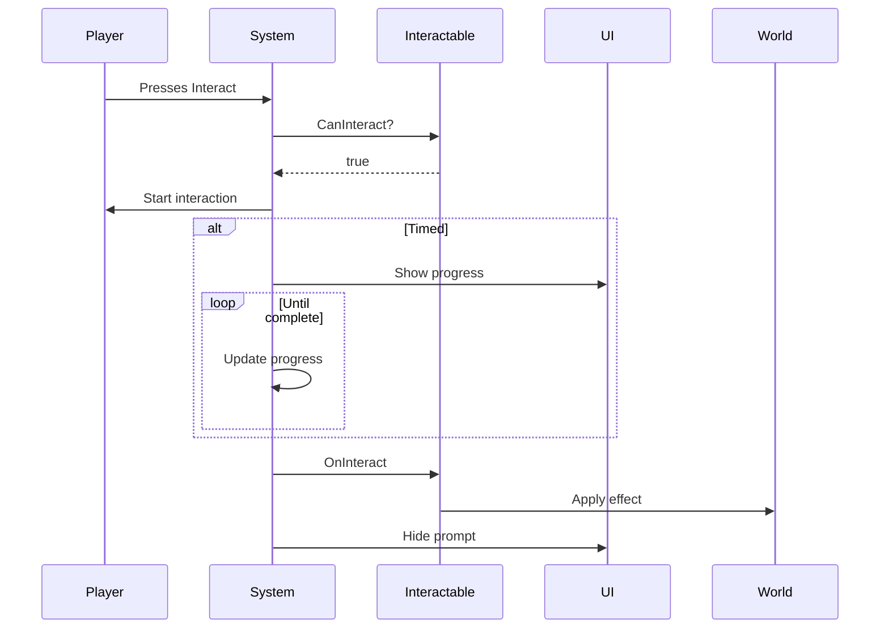

# EPIC 13.8: Interaction System

> **Status:** IMPLEMENTED ✓
> **Priority:** LOW  
> **Dependencies:** EPIC 13.2 (Ability System)  
> **Reference:** `OPSIVE/.../Runtime/Traits/Interactable.cs`

> [!IMPORTANT]
> **Architecture & Performance Requirements:**
> - **Server (Warrok_Server):** Interactable state (door open/closed, lever on/off) authoritative
> - **Client (Warrok_Client):** UI prompts via `InteractionPromptUI` MonoBehaviour
> - **NetCode:** Interaction requests sent as RPC, state changes replicated via `[GhostField]`
> - **Burst:** Detection systems (finding nearby interactables) are Burst-compiled
> - **Hybrid UI:** Prompt rendering is MonoBehaviour-based, reads ECS state each frame

## Overview

Generic system for world interactions including doors, switches, pickups, and NPCs. Provides consistent interaction UX across all interactable types.

---

## Sub-Tasks

### 13.8.1 IInteractableTarget Interface
**Status:** NOT STARTED  
**Priority:** HIGH

Define the contract for interactable objects.

#### Interface Design

```csharp
public interface IInteractableTarget
{
    bool CanInteract(Entity interactor);
    void OnInteract(Entity interactor);
    string GetInteractionMessage();
    float GetInteractionDuration();
}
```

#### ECS Implementation

```csharp
public struct Interactable : IComponentData
{
    public bool CanInteract;
    public bool RequiresHold; // Hold vs tap
    public float HoldDuration;
    public float InteractionRadius;
    public FixedString64Bytes Message; // "Press E to Open"
    public InteractableType Type;
}

public enum InteractableType : byte
{
    Instant,       // Immediate effect
    Timed,         // Hold for duration
    Toggle,        // On/off
    Animated,      // Animation-driven
    Continuous     // Hold to use
}
```

#### Acceptance Criteria

- [ ] Interactable component defined
- [ ] Multiple interaction types supported
- [ ] Custom messages per object

---

### 13.8.2 Interact Ability
**Status:** NOT STARTED  
**Priority:** HIGH

Player ability to interact with objects.

#### Algorithm

```
1. Detection (per frame):
   - Raycast or sphere overlap in front of player
   - Filter by Interactable component
   - Find best candidate (closest, most centered)
   - Show interaction prompt if valid target
2. On interact input:
   - Check CanInteract
   - If TimedHold: start progress
   - If Instant: trigger immediately
   - Disable player movement during interaction (optional)
3. On interaction complete:
   - Call target's OnInteract
   - Play feedback
   - Clear interaction state
```

#### Components

```csharp
public struct InteractAbility : IComponentData
{
    public Entity TargetEntity;
    public float InteractionProgress;
    public bool IsInteracting;
    public float DetectionRange;
    public float DetectionAngle; // Cone in front
}

public struct InteractRequest : IComponentData
{
    public Entity TargetEntity;
    public bool StartInteract;
    public bool CancelInteract;
}
```

#### Acceptance Criteria

- [ ] Nearest interactable detected
- [ ] Prompt shows for valid targets
- [ ] Hold interactions work
- [ ] Player can cancel

---

### 13.8.3 AnimatedInteractable
**Status:** NOT STARTED  
**Priority:** MEDIUM

Doors, levers, and switches with animations.

#### Algorithm

```
1. On interact:
   - Determine target state (open/closed, on/off)
   - Play transition animation
   - Update state when animation completes
2. Optional: Player animation during interaction
3. Optional: Lock player to position during animation
```

#### Components

```csharp
public struct AnimatedInteractable : IComponentData
{
    public bool IsOpen; // Current state
    public float AnimationDuration;
    public float CurrentTime;
    public bool IsAnimating;
    public bool LockPlayerDuringAnimation;
}

public struct DoorInteractable : IComponentData
{
    public float OpenAngle;
    public float ClosedAngle;
    public float SwingSpeed;
    public bool AutoClose;
    public float AutoCloseDelay;
}

public struct LeverInteractable : IComponentData
{
    public Entity TargetEntity; // What this lever controls
    public FixedString32Bytes TargetEvent; // Event to fire
    public bool IsActivated;
}
```

#### Acceptance Criteria

- [ ] Doors swing open/closed
- [ ] Levers toggle state
- [ ] Animations play smoothly
- [ ] Player optionally locked during animation

---

### 13.8.4 IInteractableMessage
**Status:** NOT STARTED  
**Priority:** MEDIUM

UI prompts for interactions.

#### Components

```csharp
public struct InteractionPrompt : IComponentData
{
    public Entity InteractableEntity;
    public FixedString64Bytes Message;
    public float HoldProgress; // 0-1 for timed
    public bool IsVisible;
}
```

#### UI Bridge

```csharp
// InteractionPromptUI.cs (MonoBehaviour)
void Update()
{
    // Read InteractionPrompt from ECS
    // Update UI elements
    // Show/hide based on IsVisible
    // Update progress bar for timed interactions
}
```

#### Acceptance Criteria

- [ ] Prompt appears when near interactable
- [ ] Shows contextual message
- [ ] Hold progress displays for timed
- [ ] Fades in/out smoothly

---

### 13.8.5 MoveTowardsLocation
**Status:** NOT STARTED  
**Priority:** LOW

Snap player to position for aligned interactions.

#### Use Cases

- Chair sitting
- Workbench usage
- Cutscene positioning
- Door handle gripping

#### Algorithm

```
1. On start interaction with MoveTowardsLocation:
   - Calculate target position/rotation
   - Disable player input
   - Lerp player to position
   - On arrival: enable interaction
2. On end interaction:
   - Lerp player out (optional)
   - Restore player input
```

#### Components

```csharp
public struct MoveTowardsLocation : IComponentData
{
    public float3 TargetPosition;
    public quaternion TargetRotation;
    public float MoveSpeed;
    public float RotateSpeed;
    public bool HasArrived;
}

public struct InteractionLocation : IComponentData
{
    public float3 EnterPosition;
    public float3 ExitPosition;
    public quaternion InteractionRotation;
    public bool SnapToPosition;
}
```

#### Acceptance Criteria

- [ ] Player moves to interaction position
- [ ] Rotation aligns correctly
- [ ] Smooth movement
- [ ] Exit position works

---

## Files to Create

| File | Purpose |
|------|---------|
| `InteractableComponents.cs` | Core interaction components |
| `InteractAbilitySystem.cs` | Player interaction logic |
| `InteractableDetectionSystem.cs` | Find nearby interactables |
| `AnimatedInteractableSystem.cs` | Doors, levers, switches |
| `InteractionPromptSystem.cs` | UI prompt logic |
| `InteractionPromptUI.cs` | UI MonoBehaviour |
| `MoveTowardsLocationSystem.cs` | Position snapping |
| `InteractableAuthoring.cs` | Inspector setup |
| `DoorAuthoring.cs` | Door-specific setup |
| `LeverAuthoring.cs` | Lever-specific setup |

## Designer Setup Guide

### Creating Interactables

#### Basic Door

1. Add `InteractableAuthoring` to door pivot
2. Set Type = `Animated`
3. Add `DoorAuthoring`
   - Open Angle = 90
   - Closed Angle = 0
   - Swing Speed = 2
4. Set Message = "Open Door"

#### Lever

1. Add `InteractableAuthoring` to lever
2. Set Type = `Toggle`
3. Add `LeverAuthoring`
   - Target Entity = door or mechanism
   - Event = "Toggle"

#### Timed Interaction (Hacking)

1. Add `InteractableAuthoring`
2. Set Type = `Timed`
3. Set HoldDuration = 3.0
4. Set Message = "Hold E to Hack"

### Interaction Flow



---

## Verification Plan

### Manual Verification

1. Approach door, see "Open Door" prompt
2. Press interact, door swings open
3. Approach again, see "Close Door"
4. Test timed interaction (hold button)
5. Test canceling timed interaction
6. Test interaction while moving platform
