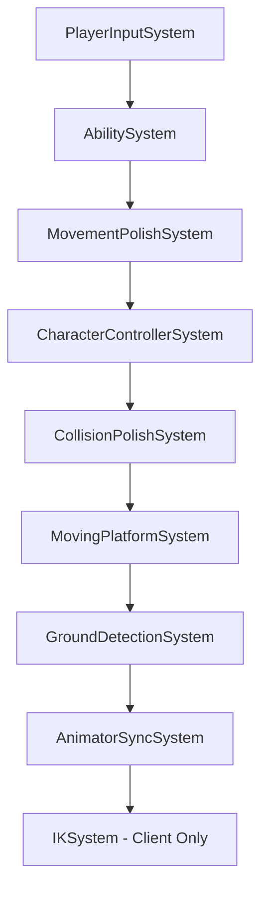

# EPIC 13: Character Controller 2.0

> [!IMPORTANT]
> **Performance Requirements for All Epic 13 Systems:**
> - All systems must be **Burst-compiled** (`[BurstCompile]`)
> - Use **IJobEntity** or **IJobChunk** for entity iteration
> - Use **ScheduleParallel** where entities can be processed independently
> - **Never block main thread** - no managed allocations in hot paths
> - All components with network relevance must use `[GhostField]` attributes
> - Follow the **Warrok_Server / Warrok_Client** prefab pattern (see below)

## Overview

This Epic modernizes the DIG character controller with advanced features adapted from Opsive Ultimate Character Controller (UCC). The implementation follows ECS/DOTS patterns with NetCode integration.

---

## 🎮 Client/Server Prefab Architecture

DIG uses a split-prefab architecture linked via `GhostPresentationGameObjectAuthoring`. When implementing new features, understand which prefab owns each responsibility:

### Warrok_Server (ECS Ghost Entity)

The **server prefab** is the authoritative entity that gets replicated. It contains:

| Component | Purpose |
|-----------|---------|
| `GhostAuthoringComponent` | NetCode ghost configuration (Owner-Predicted) |
| `PlayerAuthoring` | Player identity and base stats |
| `CharacterControllerAuthoring` | ECS physics capsule, collision settings |
| `PlayerInputAuthoring` | Input settings (sensitivity, deadzone) |
| `FallDamageAuthoring` | Fall damage thresholds |
| `SurvivalAuthoring` | EVA, jetpack, oxygen, radiation |
| `SwimmingAuthoring` | Swimming mechanics |
| `FreeClimbSettingsAuthoring` | Climbing configuration |
| `StressAuthoring` | Stress system |
| `RagdollAuthoring` | Ragdoll bone references |
| `GhostPresentationGameObjectAuthoring` | Links to Warrok_Client |

**Key insight:** Server prefab has **no visual components** - no SkinnedMeshRenderer, no Animator, no AudioSource.

### Warrok_Client (Presentation GameObject)

The **client prefab** is the visual representation spawned locally. It contains:

| Component | Purpose |
|-----------|---------|
| `GhostPresentationGameObjectEntityOwner` | Links back to ECS entity |
| `SkinnedMeshRenderer` | Visual mesh |
| `Animator` | Animation state machine |
| `AnimatorRigBridge` | ECS → Animator parameter sync |
| `AnimatorEventBridge` | Animation events (footsteps) |
| `KinematicCharacterController` | Fallback/presentation movement |
| `LandingAnimatorBridge` | Landing animation sync |
| `AudioManager` | Sound management |
| Ragdoll colliders/joints | Physics ragdoll (per bone) |

**Key insight:** Client prefab **receives state from ECS** and visualizes it. It doesn't make authoritative decisions.

### Implementation Pattern

```csharp
// SERVER-SIDE: ECS System (runs on server + predicted client)
[BurstCompile]
[UpdateInGroup(typeof(PredictedSimulationSystemGroup))]
public partial struct MovementPolishSystem : ISystem
{
    [BurstCompile]
    public void OnUpdate(ref SystemState state)
    {
        new MovementPolishJob { DeltaTime = SystemAPI.Time.DeltaTime }
            .ScheduleParallel();
    }
}

// CLIENT-SIDE: Hybrid bridge (runs only on client, reads ECS state)
public class VisualBridge : MonoBehaviour
{
    private Entity linkedEntity;
    
    void LateUpdate()
    {
        // Read replicated state from ECS entity
        var state = EntityManager.GetComponentData<MovementState>(linkedEntity);
        animator.SetFloat("Speed", state.Speed);
    }
}
```

---

## Sub-Epics

| Epic | Status | Description |
|------|--------|-------------|
| [EPIC 13.1](./EPIC13.1.md) | NOT STARTED | Core Locomotion Enhancements (Moving Platforms, Root Motion, External Forces) |
| [EPIC 13.2](./EPIC13.2.md) | NOT STARTED | Ability System Architecture (Base class, starters/stoppers, detection patterns) |
| [EPIC 13.3](./EPIC13.3.md) | NOT STARTED | Movement Polish (QuickStart/Stop/Turn, Fall Ability, Speed Changes) |
| [EPIC 13.4](./EPIC13.4.md) | NOT STARTED | IK System (Foot Placement, Look-At IK, Hand IK) |
| [EPIC 13.5](./EPIC13.5.md) | COMPLETED | Locomotion Abilities & Refactor (Jump, Crouch, Sprint abilities) |
| [EPIC 13.6](./EPIC13.6.md) | NOT STARTED | Items & Inventory Framework (Equip/Unequip, slots, perspectives) |
| [EPIC 13.7](./EPIC13.7.md) | NOT STARTED | Weapons Framework (Shootable, Melee, Throwable, Shield) |
| [EPIC 13.8](./EPIC13.8.md) | NOT STARTED | Interaction System (Interactables, UI prompts, animated objects) |
| [EPIC 13.9](./EPIC13.9.md) | COMPLETED | Interaction System Unification |
| [EPIC 13.10](./EPIC13.10.md) | COMPLETED | Voxel Performance Optimization |
| [EPIC 13.11](./EPIC13.11.md) | COMPLETED | Multiplayer Flashlight System |
| [EPIC 13.12](./EPIC13.12.md) | COMPLETED | Flashlight Bandwidth Optimization |
| [EPIC 13.13](./EPIC13.13.md) | COMPLETED | Jump System Parity (Ceiling check, slope limit, hold-for-height, double jump) |
| [EPIC 13.14](./EPIC13.14.md) | NOT STARTED | Fall System Parity (Min height, land VFX/audio, animation events) |
| [EPIC 13.15](./EPIC13.15.md) | NOT STARTED | Crouch/HeightChange Parity (Standup obstruction, collider resize) |
| [EPIC 13.16](./EPIC13.16.md) | NOT STARTED | Health & Damage Parity (Hitbox multipliers, shield, death spawns) |
| [EPIC 13.17](./EPIC13.17.md) | NOT STARTED | Interaction Parity (Animation events, IK targets, MoveTowards) |
| [EPIC 13.18](./EPIC13.18.md) | NOT STARTED | Surface Effects Parity (Decals, impact VFX, surface-aware audio) |

## Dependencies

- EPIC 1: Character Controller (base movement) - **REQUIRED**
- EPIC 12: Advanced Traversal (climbing patterns) - Optional reference

## Reference Implementation

Features adapted from Opsive Ultimate Character Controller:
- **Core:** `OPSIVE/com.opsive.ultimatecharactercontroller/Runtime/Character/`
- **Abilities:** `OPSIVE/com.opsive.ultimatecharactercontroller/Runtime/Character/Abilities/`
- **Items:** `OPSIVE/com.opsive.ultimatecharactercontroller/Runtime/Items/`
- **Traits:** `OPSIVE/com.opsive.ultimatecharactercontroller/Runtime/Traits/`

---

## Architecture Notes

### Performance Requirements

All systems in Epic 13 must adhere to these performance standards:

| Requirement | Implementation |
|-------------|----------------|
| **Burst Compilation** | `[BurstCompile]` on all systems and jobs |
| **Parallel Processing** | `ScheduleParallel()` for independent entity work |
| **No Main Thread Blocking** | Zero managed allocations in OnUpdate |
| **Cache-Friendly Data** | Prefer blittable types, avoid references |
| **Minimal Sync Points** | Batch ECB operations, use deferred playback |

### NetCode Integration

| Component Type | GhostField Usage |
|---------------|------------------|
| Position/Rotation | `[GhostField(Quantization=1000)]` |
| State flags | `[GhostField]` (1-bit optimization) |
| Float params | `[GhostField(Quantization=100)]` |
| Input-only data | Mark as `SendToOwner` |
| Client-only visuals | No ghosting needed |

### ECS Adaptation Strategy

| Opsive Pattern | DIG ECS Pattern |
|----------------|--------------------|
| MonoBehaviour state | IComponentData |
| Update/LateUpdate | ISystem.OnUpdate |
| Coroutines | State machine in components |
| UnityEngine.Physics | Unity.Physics |
| Animator.SetParameter | Hybrid bridge pattern |
| Events/Callbacks | ECS events or RPC |

### System Update Order



---

## Priority Order

For maximum impact with minimal effort:
1. **13.1** Core Locomotion - Foundation for all movement
2. **13.3** Movement Polish - Immediate "feel" improvement
3. **13.4** IK System - Visual polish
4. **13.5** Surface System - Environmental feedback

Skip 13.6-13.8 unless weapons/items are specifically needed.
